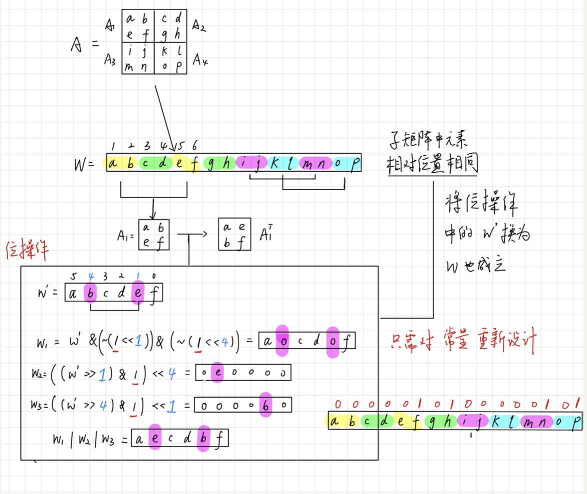
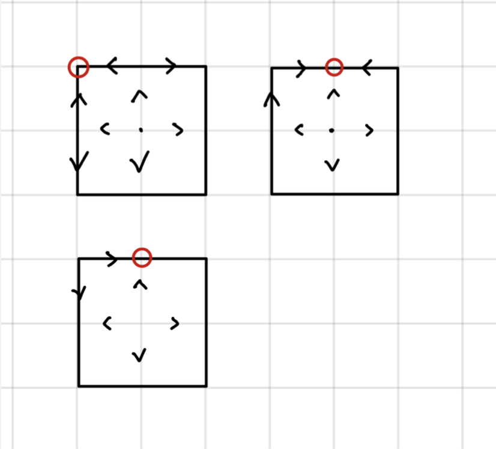
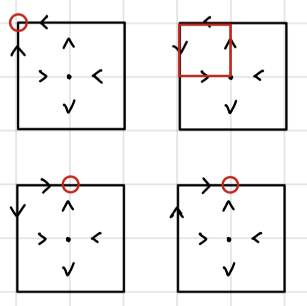

# Assignment 1

​				 				     						 *521030910073  黄奔皓*

[TOC]


## Problem 1

let $n/b^t \lt b \Rightarrow t \gt \log _bn-1$.  $t=\lceil\log _bn-1 \rceil$
$$
\begin{aligned}
T(n)
&=a T(n / b)+n^d \log ^w n \\
&=a[aT(n / b^2)+(n/b)^d \log ^w(n / b)]+ n^d\log ^w n \\
&=a^t+n^d[(\frac{a}{b^d})^0\log ^w n + (\frac{a}{b^d})^1\log ^w (n/b)+\cdots+(\frac{a}{b^d})^{t-1}\log ^w (n/b^{t-1})] \\
&\xlongequal{c = \frac{a}{b^d}}a^t+n^d[c^0\log ^w n + c^1\log ^w (n/b)+\cdots+c^{t-1}\log ^w (n/b^{t-1})] \\ 
& = n^{\log _b a} + n^d\sum_{i=0}^{t-1}c^i\log^w(n/b^i)
\end{aligned}
$$
$O(c^i\log^w(n/b^i))=c^i\log^w(n)+c^iO(\log^w(n))$
$$
\begin{aligned}
T(n)
& = n^{\log _b a} + n^d\sum_{i=0}^{t-1}c^i\log^w(n/b^i) \\
&=  n^{\log _b a} + n^d\sum_{i=0}^{t-1}c^i\log^w(n)+c^iO(\log^w(n)) \\
\end{aligned}
$$

### Case 1: if $a\lt b^d,c\lt 1$

$\because \log_b a \lt d$

$\therefore$
$$
\begin{aligned}
T(n)
& = n^{\log _b a} + n^d\frac{1-c^t}{1-c}[\log^w(n)+O(\log^w(n)) ]\\
& = n^d[\log^w(n)+O(\log^w(n)) ]\\
& = O(n^d\log^w(n))\\
\end{aligned}
$$

### Case 2:  if $a\gt b^d,c\gt1$

$\because \log_b a \gt d$

$\because \forall a,b,d, \exist \epsilon \gt0,s.t.$
$$
\frac{1-n^{d-\log_b a}}{\frac{a}{b^d}-1}\lt \frac{1}{n^{\epsilon}}
$$
$\therefore$
$$
\frac{1-c^t}{1-c}\lt\frac{n^{\log_b a - \epsilon}}{n^d}
$$
$\therefore$
$$
\begin{aligned}
T(n)
& = n^{\log _b a} + n^d\frac{1-c^t}{1-c}[\log^w(n)+O(\log^w(n)) ]\\
& = n^{\log _b a} + O(n^{\log_b a - \epsilon}\cdot\log^w(n)) \\
& = O(n^{\log_b a})
\end{aligned}
$$

### Case 3: if $a=b^d,c=1$

$$
\begin{aligned}
T(n)
& = n^{\log _b a} + n^d\sum_{i=0}^{t-1}c^i\log^w(n/b^i) \\
&=  n^{\log _b a} + n^d\sum_{i=0}^{t-1}\log^w(n)+O(\log^w(n)) \\
&= n^{d} + n^d\log_bn\cdot \log^w(n)\\
&=O(n^d \log^{w+1}(n))
\end{aligned}
$$

## Problem 2

### Notation

1. $v$: the pivot

2. subset $L$: $x\lt v$

3. subset $R$: $x > v$

4. subset $M$: $x = v$

5. $C_1n:$ the steps to find the median of a small size group.(3 size, 5 size, 7 size, 9 size....)

   For these small groups, we will use simple algorithm to find its median, like bubble sort. We should ensure the $O(1)$ for each group median derivation. 

   For size $s$, in the worse case bubble sort could take $\frac{s(s-1)}{2}$ comparison steps to find the median. 

   Therefore, $C_1n=\frac{s(s-1)}{2}\cdot n/s$

6. $C_2n:$  the steps to partition the set into $L,R,M$

   if we implement it in this way:

```C++
   // O(n)
    for(int j = 0; j < a.size(); ++j){
        if(a[j] < pivot){
            L.push_back(a[j]);
        } else if(a[j] == pivot){
            M.push_back(a[j]);
        } else {
            R.push_back(a[j]);
        }
    }
```

​	Then $C_2$ could be considered as 2.

### Group By 5

From lecture we know that when grouped by 5, the algorithm has linear time complexity $Bn$.And we have $C_1=4 \cdot5/10=2$, then$Bn=10(C_1+C_2)=40$

### Group By 3

1. We have $\frac{n}{3}$ groups, so $\frac{n}{3}$ medians. the median of median $v$ is no greater than $\frac{n}{6}$ integers, is no less than $\frac{n}{6}$ integers.

2. Each median is no greater than 1 integers, is no less than 1 integers.
3. $v$ is no greater than $\frac{n}{3}$ integers, is no less than $\frac{n}{3}$ integers.

In recursive part, $max(T(|R|,T(|M|),T(|L|))\le T(\frac{2}{3}n)$
$$
T(n)=nC_1+T(\frac{n}{3})+T(\frac{2}{3}n)+O(n)
$$
Here $O(n)$ is the cost of division. Assume $O(n)= C_2n$, we drop the Big-O notation.
$$
T(n)=T(\frac{n}{3})+T(\frac{2}{3}n)+(C_1+C_2)n
$$
We prove that in this case $T(n)$ can't be linear. Assuming $T(n) = Bn$, then we have 
$$
Bn=T(n)=2/3 Bn + 1/3 Bn = T(\frac{n}{3})+T(\frac{2}{3}n)
$$
Thus $(C_1+C_2)n=0$, leading to contradiction. 

**Therefore, grouping by 5 is better than 3.**

### Group By 7

In this case, 

1. We have $\frac{n}{7}$ groups, so $\frac{n}{7}$ medians. the median of median $v$ is no greater than $\frac{n}{14}$ integers, is no less than $\frac{n}{14}$ integers.

2. Each median is no greater than 3 integers, is no less than 3 integers.
3. $v$ is no greater than $\frac{2n}{7}$ integers, is no less than $\frac{2n}{7}$ integers.

In recursive part, $max(T(|R|,T(|M|),T(|L|))\le T(\frac{5n}{7})$
$$
T(n)=T(\frac{n}{7})+T(\frac{5}{7}n)+(C_1+C_2)n
$$
Assuming $T(n)\le Bn$

Then $B \ge 7(C_1+C_2)=14+3\cdot 7=35$

### Group By 9

In this case, 

1. We have $\frac{n}{9}$ groups, so $\frac{n}{9}$ medians. the median of median $v$ is no greater than $\frac{n}{18}$ integers, is no less than $\frac{n}{18}$ integers.

2. Each median is no greater than 4 integers, is no less than 4 integers.
3. $v$ is no greater than $\frac{5n}{18}$ integers, is no less than $\frac{5n}{18}$ integers.

In recursive part, $max(T(|R|,T(|M|),T(|L|))\le T(\frac{13n}{18})$
$$
T(n)=T(\frac{n}{9})+T(\frac{13}{18}n)+(C_1+C_2)n
$$
Assuming $T(n)\le Bn$

Then $B \ge 6(C_1+C_2)=36$

### Summary

So why don't we use even number? Because it causes trouble when selecting the median from an array of even size. 

For odd size, actually we could give the equation to analyze.
$$
T(n)=T(\frac{n}{s})+T(\frac{3s-1}{4s}n)+(C_1+C_2)n
$$

$$
B = \frac{4s}{s-3}(C_1+C_2)=\frac{4s}{s-3}(2+\frac{(s-1)}{2})
$$

$B$ is increasing when $S\in(3\sqrt{2},+\infty)$ 

**Therefore, grouped by 7 is the best choice in this case, where we use naive bubble sort to find the medians among small groups, and consider the cost to partition n elments into L,M,R to be $2n$, without precise and further analysis using expectation.**


## Problem 3

We denote these n integers as a[1], a[2], a[3],...a[n], where n is an even number. So we are able to divide it into $\frac{n}{2}$ groups of size 2, consisting of two adjacent a[i], a[i+1], where i starts from i = 1.

For example:
$$
(a[1],a[2]),(a[3],a[4]),\cdots,(a[n-1],a[n])
$$
Then we take $\frac{n}{2}$ comparisons to to put the bigger one in this groups into another group A, the smaller one into group B.

Obviously, the maximum is among group A, while the minimum is among the group B.

Then we scan through each group, A and B, to get the maximum and minimum correspondingly, which takes $\frac{n}{2}-1+\frac{n}{2}-1=n-2$ comparisons.

Altogether, it costs $\frac{3}{2}n-2$ comparisons to find the maximum and minimum of n integers.

## Problem 4

### Question(a)


$$
h^2\le w
$$
$h=\lfloor\sqrt{w}\rfloor$. To store the matrix in one word, we could store matrices in diagonal order. For example, if we have a matrix like below:
$$
A=\left(
\begin{array}{ll}
a & b & c\\
d & e & f \\
g & h & i \\
\end{array}
\right)
$$
we could store it in a word by this order: 
$$
[(a),(b,d),(c,e,g),(f,h),(i)]
$$
**This store method is corresponding to the trial 1!  There will be other methods mentioned below!** 

### Question(b)

#### Trial 1

##### Raise the sub problem

We notice that:
$$
A^T=\left(
\begin{array}{ll}
a & d & g\\
b & e & h \\
c & f & i \\
\end{array}
\right)
$$
In the word form, it's:
$$
[(a),(d,b),(g,e,c),(h,f),(i)]
$$
If we want to get the transpose of $A$, we could just reverse the bit group (marked out with brace) in the word respectively, then we could get the result.

**Then we need to solve the sub problem first: reverse the bit groups.**

##### Algorithm

Since teacher Zhang has pointed out, we could assume the $h$ is the in the form of $2^t$ ($h$ is the side length of the Matrix).

For convenience, here we might as well let $t=5,h=32$, and explain the algorithm used as follows:

```c++
unsignedint reverseBits(unsigned int word)
{
	word = (word & 0x55555555) <<1 | (word >>1) & 0x55555555;   // 1
	word = (word & 0x33333333) <<2 | (word >>2) & 0x33333333;   // 2
	word = (word & 0x0F0F0F0F) <<4 | (word >>4) & 0x0F0F0F0F;   // 4
	word = (word & 0x00FF00FF) <<8 | (word >>8) & 0x00FF00FF;   // 8
	word = (word & 0x0000FFFF) <<16 | (word >>16) & 0x0000FFFF; // 16
	return word;
}
```

 Then the bits of the word is reversed. Details are displayed as follows:

​	word：`a b c d e f g h i j k l m n o p q r s t u v w x y z A B C D E F` 32 bit

*Step one:*

> 0x55555555：0101|0101|0101|0101|0101|0101|0101|0101
>
1. word & 0x55555555 → `0 b 0 d 0 f 0 h 0 j 0 l 0 n 0 p 0 r 0 t 0 v 0 x 0 z 0 B 0 D 0 F`
2. word = (word & 0x55555555) << 1 → `b 0 d 0 f 0 h 0 j 0 l 0 n 0 p 0 r 0 t 0 v 0 x 0 z 0 B 0 D 0 F 0`
3. word >> 1 → `0 a b c d e f g h i j k l m n o p q r s t u v w x y z A B C D E`
4. (word >> 1) & 0x55555555 → `0 a 0 c 0 e 0 g 0 i 0 k 0 m 0 o 0 q 0 s 0 u 0 w 0 y 0 A 0 C 0 E`
5. (word & 0x55555555) << 1 | (word >> 1) & 0x55555555

​		word1 : `b 0 d 0 f 0 h 0 j 0 l 0 n 0 p 0 r 0 t 0 v 0 x 0 z 0 B 0 D 0 F 0`

​		word2 : `0 a 0 c 0 e 0 g 0 i 0 k 0 m 0 o 0 q 0 s 0 u 0 w 0 y 0 A 0 C 0 E`

​		word = word1 | word2 : `b a d c f e h g j i l k n m p o r q t s v u x w z y B A D C F E`

*Step Two:*

> 0x33333333：0011|0011|0011|0011|0011|0011|0011
>

word →  `d c b a | h g f e | l k j i | p o n m | t s r q | x w v u | B A z y | F E D C`

*Step Three:*

...

Obviously, the time complexity of this algorithm is $O(\log h)=O(t)$

##### Solution

Then consider the example:
$$
[(a),(d,b),(g,e,c),(h,f),(i)]
$$
Here we have 5 sub-words to reverse. To get each sub-word, we should previously process them word as follows:

```
// pseudo code
sub-word 1 = word & 100000000
sub-word 2 = word & 011000000
sub-word 3 = word & 000111000
sub-word 4 = word & 000000110
sub-word 5 = word & 000000001
```

Then the final result could be given as:

```
res = 0
For sub-word in word:
	res += reverseBits(sub-word)
```

==**However, if including the time used to process the sub-word, this method won't be in $O(\log w)$, it's $O(\sqrt{w})$. It fails...**==

#### Trial 2

##### Revisit to Storation

Since the trial one fails and I can't optimize the algorithm, I shift my attention to modify the storation method.

If we store the matrix in this way:

a[0] ~ a[h - 1] stores the diagnoal element from top left to bottom right. (zero index)

a[h : - 1] stores the elements in pair(not really a pair in the array, just for clarity), in the order:

($A_{0,1},A_{1,0}$), ($A_{0,2},A_{2,0}$), ($A_{0,3},A_{3,0}$),  ($A_{1,2},A_{2,1}$), $\cdots,$ ($A_{i,j},A_{j,i}$), $\cdots$  =
$$
\left\{ (A_{i,j},A_{j,i})|i+j=k,k=1,2,3,\cdots,h\right\}(i,j,k\in N)
$$
The elements in the set are firstly ordered from small k to big k, and secondly ordered by i, from small to big.

For example:
$$
A=\left(
\begin{array}{ll}
a & b & c & d\\
e & f & g & h\\
i & j & k & l\\
m & n & o &p \\
\end{array}
\right)
$$

$$
A=[a,f,k,p,(b,e),(c,i),(d,m),(g,j),(h,n),(l,o)]
$$

Then the transpose of $A^T$ is:
$$
A^T=[a,f,k,p,(e,b),(i,c),(m,d),(j,g),(n,h),(o,l)]
$$


##### Algorithm

From observation, we know that we can simply reverse the order in each pair to get $A^T$, which has been done in the trial 1. Still for convenience, here we might as well let $t=2,h=4$. Combined with the algorithm in trial 1, we can design the new algorithm as follow:

```C++
unsignedint reverseBits(unsigned int word)
{
  diagonal = word & 0xF000; // save the diagnoal elements
  remain = word & 0x0FFF; // get the elements to be operated on
	remain = (remain & 0xF555) <<1 | (remain >>1) & 0xF555; 
  word = diagonal + remain;
	return word;
}
```

For a fixed $w$, we could always design the constant used in the algorithm specifically.

**This algorithm's time complexity is $O(1)$, which is within $O(\log w)$**

#### Trial 3

In fact, we could just store the matrix in a normal order, from left to right, top to bottom,  and still solve the problem.

##### Algorithm

We could solve the problem by following steps:

1. divide the matrix into four sub matrices:
   $$
   A=\left[
   \begin{array}{cc}
   A_1 & A_2 \\
   A_3 & A_4
   \end{array}
   \right]
   $$

2. Switch the position of $A_2$ and $A_3$ to get
   $$
   A'=\left[
   \begin{array}{cc}
   A_1 & A_3 \\
   A_2 & A_4
   \end{array}
   \right]
   $$

3. **Simultaneously** transpose $A_1,A_2,A_3,A_4$ to get
   $$
   A^T=\left[
   \begin{array}{cc}
   A_1^T & A_3^T \\
   A_2^T & A_4^T
   \end{array}
   \right]
   $$

##### Analysis

Concerning step 2, it will cost $O(1)$.  For example: (for clarity, we use numbers here to be distinguished from eq.（25）)
$$
A=\left(
\begin{array}{ll}
1 & 2 & 3 & 4\\
5 & 6 & 7 & 8\\
9 & 10 & 11 & 12\\
13 & 14 & 15 &16 \\
\end{array}
\right)
$$

$$
1,2,\underline{3,4}|5,6,7,8|\underline{9,10},11,12|13,14,15,16  \\
1,2,3,4|5,6,\underline{7,8}|9,10,11,12|\underline{13,14},15,16
$$
The underline parts is the numbers to switch position.

Similar to the practice in trial 1, 2, we could use unit operation like and, shift, or ... to complete the task. For example:

```
word = 1,2,3,4,5,6,7,8,9,10,11,12,13,14,15,16 && 0x30C0;
word = (word1 >> 6) || (word1 << 6);
```

This operation takes $O(1)$ for a fixed $w$. Therefore, step 2 take $O(1)$.

As for step 3, we emphasize "simultaneously" here to distinguish it from the usuall parallel "divide and conquer" methods, that is, here we don't need to calculate the transpose of four sub matrix one by one, we could do it simultaneously.



**(For convenience, the graph above dismisses the switch step between $A_2,A_3$）**

The reasons are as follows:

1. The operation we use to transpose a matrix stored in the word form will only include unit operations like shift, and, or... etc.

2. The relative positions of the elements are the same between each submatrix

3. If we carry out a certain unit operation on $A_i$, we could simultaneously do it on $A_j,j\ne i$

   *Pf*: Let v denote a certain bit string.  **Here "||" simply means concatenation.** For a certain step in transposing the matrix, 

   * v && $A_1$, then we could do ($v || v$)  &  ($A_1||A_2$)
   * v | $A_1$, then we could do ($v || v$)  |  ($A_1||A_2$)
   * $A_1$ >> x, then we could do  ($A_1||A_2$) >> x
   * $A_2$ << x, then we could do  ($A_1||A_2$) <<  x

This is similar to the concept of SIMD (single-instruction multiple-data). Thus, we could transpose all four sub matrix in one move, then we have:
$$
T(w)=T(w/4)+O(1)
$$


This means the algorithm is $O(\log w)$

## Problem 5

### Question(a)

#### **Lemma**

> In a square of size $2\times 2$, there exists a vertex satisfying the requirement.

Pf:

We divide the problem into four cases based on the configuration of the central vertex of the square.

##### **Case 1**


Obviously, the centrual vertex its self satisfies the requirement

##### **Case 2**


By symmetry, it can be concluded as three cases below:



Each case there exists at least a vertex satisfying the requirement.

##### **Case 3**


it can be concluded as four cases below:



Each case there exists at least a vertex satisfying the requirement.

##### **Case 4**


This case is symetric to the case 3.

Thus, to find the vertex with out-degree 0 or one directed cycle, we could just check the square in the top-left corner of the grids, which takes a constant steps to find the vertex. It's time complexity is actually $O(1)$, in the $O(\log n)$

### Question(b)

#### Raise the sub problem

In this case, we notice that there won't exist a directed circle, otherwise there will be a sequence where:
$$
a>b>c>d>a
$$
So, we should focused on the vertex with 0 out-degree.

**Then the problem has been translated into finding the local minimum of a $n \times n$ matrix.**

#### Algorithm

The algortihm designed is as follow:

1. Find the minimum number in the range of matrix boarder, the middle row and the middle column. We should scan through $6n-9$ vertex to find the minimum, which has the time complexity of $O(n)$
2. Check the upper, lower, left, right side(**if exists and hasn't been visited yet**) of the minimum number. If the minimum number is at the corner(8 points in a square), then we find the wanted point. If there exists a smaller number, then carry out the procedure similar to step 1 on the smaller matrix where the smaller number is included, namely, a $\frac{n}{2} \times \frac{n}{2}$ square. Note that here we don't need to check the boarder of the smaller matrix since it has been visited in the step 1.
3. Keep repeating the steps above untill find a local minimum number.

The correctness of this algorithm can be proved as followed:

* If step 1 finds a local minimum, then the problem has been solved.
* If not, then we can find the adjacent vertex of the current minimum and enter the corresponding matrix
* The local minimum surely exists in the smaller matrix
  * If the minimum of the smaller matrix is on the boarder, then we won't enter the smaller matrix, contradicted.
  * Thus the minimum must be located inside the smaller matrix, implying that the local minimum exists.

#### Time complexity

The analysis of time complexity is:
$$
T(n)=T(\frac{n}{2})+O(n)
$$
Here $T(n)$ is the time polynomial when the size of the matrix is $n\times n$.

$O(n)$ is the cost of searching for the minimum among the boarder, the middle row and the middle column of the matrix.

By master theorem, 
$$
T(n)=aT(\frac{n}{b})+O(n^d)
$$
Here $a=1,b=2,d=1,a<b^d$

Therefore,  $T(n)=O(n)$

## Problem 6

Difficulty : 5

Collaborator(Of whom I have asked questions): 李佳鑫、李禛

Discussant(With whom I have shared my ideas): 朱鹏翔、郑普嘉、刘易洲、陈奕锦、贾天宇

Hours spent: 12h