# Problem 1

*****

### a)

==Bellman-Ford==

> **Function** bellman_ford $(G, S)$
> 		$	\operatorname{dist}[s]=0, \operatorname{dist}[x]=\infty$ for other $x \in V$
> 		while $\exists \operatorname{dist}[x]$ is updated
> 				for each $(u, v) \in E$
> 						$\operatorname{dist}[v]=\min \{\operatorname{dist}[v], \operatorname{dist}[u]+d(u, v)\}$

Assume there is no update at $|V|$ round, which means:
$$
\forall (u,v) \in E,dist(v) \le dist(u)+dist(u,v)
$$
 Here $(u,v)$ denotes there is a directed edge $u\rightarrow v$.

However, if we apply this to the edge constituting negative cycle $C$ 
$$
u_1 \rightarrow u_2 \rightarrow u_3 \rightarrow \cdots \rightarrow  u_n \rightarrow u_1
$$
then we get:
$$
\begin{aligned}
dist(u_2) &\le dist(u_1)+dist(u_1,u_2) \\
dist(u_3) &\le dist(u_2)+dist(u_2,u_3) \\
&\quad \quad \quad \quad\vdots \\
dist(u_n) &\le dist(u_{n-1})+dist(u_{n-1},u_{n}) \\
dist(u_1) &\le dist(u_{n})+dist(u_{n},u_{1}) \\
\end{aligned}
$$
Sum the inequalities above we get:
$$
 \sum_{i=1}^n dist(u_i,u_{i+1})\ge0, (u_{n+1}=u_1)
$$
which contradicts to the fact that the weight of the cycle is negative.

### b)

We construct a graph with $|V|=5$ like below:

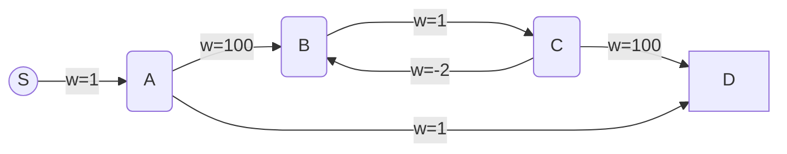

WLOG, we assume the iteration order of the edges is from right to left, and particularly consider the worst case of Bellman-Ford ALG, ==i.e. every update is based on the distance in last iteration.==

==*Iteration 1*==

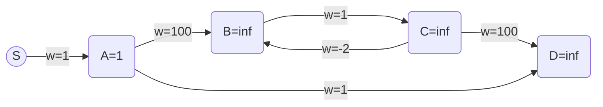

==*Iteration 2*==

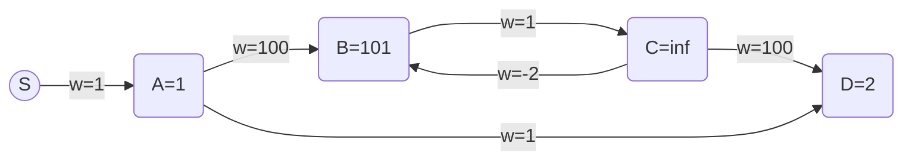

==*Iteration 3*==

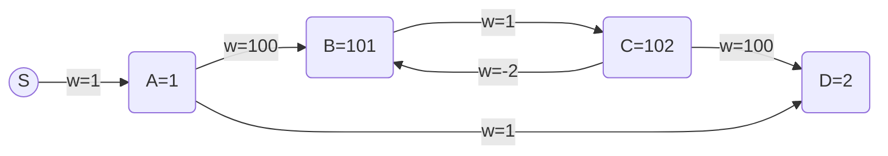

==*Iteration 4*==

*==Iteration 5==*

Terminate after $|V|=5$ rounds.

we find that though there exists a path from $S$ to $D$ containing a negative cycle, for example, $S \rightarrow A \rightarrow B\rightarrow C\rightarrow B\rightarrow C\rightarrow D$, $dist(D)$ is not updated at $|V|-th$ iteration.

### c)

#### ==Algorithm==

All the graphs are stored using adjacent lists.

> Modified Bellman-Ford
>
> 1. Apply DFS to the source $S$ on $G$ and store all the vertex visited and all it's reversed edge covering these and only these vertices in a new graph $\tilde{G}$.
> 2. Apply DFS to a single vertex $t$ on $\tilde{G}$ and store all the vertex visited and all it's edge covering these and only these vertices in another new graph $G'$. Since we use adjacent lists to store the graph, just put the vertices visited in $G'$ is enough.
> 3. Apply Bellman-Ford ALG to $G'$
>    1. If at the $|V'|$-th round there exists updated vertex then negative cycle exists in the $t$-to-$s$  path.
>    2. o.w. Such path does not exist.

#### ==Correctness Analysis==

Note there DFS to a single vertex $v$ means that we won't enter the outer loop of DFS.

`step 1` exclude the part of the graph which is actually unreachable from S. ==(Later we add condtion that $S$ can reach all points, but I think this addition is unnecessary)==

After `step 2`  we will get a graph $G'$ consists of $t-s$ paths. Because $\forall v \in$ $\tilde{G}$ , we could always starts from it and get to $S$. Given this presiquite, if we apply DFS to $t$ then, we just add $t$ to the head of such path which starts from the neighbor of $t$ and could reach $S$.

==*Lemma*== 

> **If there exists a negative cycle in $G'$, then there exists a t-to-s path with a negative cycle.**

> Proof: Since we know that for any vertex $v$ in $G'$, there exists a path $p_1$ from $v$ to $S$ ($S$ can reach any vertex) and there also exists a path $p_2$ from $t$ to $v$, for $v\in $ negative cycle, we add the cycle to make $p_1 \rightarrow cycle \rightarrow p_2$ is also a $t$ to $s$ path.

****

Then by Bellman-Ford ALG, we could judge whether there exists a negative cycle. Combined with the lemma above and partial symmetry property between $G$ and $G'$ , we could decide if there is an s-t path that contains a negatively weighted cycle in the original graph $G$.

#### ==Time Complexity==

1. `DFS to the source and get reversed graph`   $O(C(|V|+|E|))=O(|V|+|E|)$
2. `DFS to a single vertext t and get a new graph `  $O(C(|V|+|E|))=O(|V|+|E|)$

   Note that the time comlexity to reverse a graph stored using adjacent list is $O(|V|+|E|)$.
3. `Bellman-Ford`  $O(|V||E|)$

Here $C$ is a constant.

**Total: **$O(|V||E|)$

# Problem 2

****

Denote $SCC(v)$ as the strong connected component including vertex $v$

#### ==Algorithm==

> 1. Get SCC graph of $G(V,E)$, denote it as $\tilde{G}(V',E')$
> 2. Assign all the weight of $E'$ to be $-1$
> 3. Apply Bellman-Ford to $\tilde{G}$ to get the shortest distance from $SCC(s)$ to $SCC(t)$
>    1. if $dis(SCC(s),SCC(t)) = 1-|V'|$, then such path exists
>    2. o.w. Such path does not exist

#### ==Correctness Analysis==

Since the vertices in the same $SCC$  are already connected, if we get the $SCC$ graph $\tilde{G}(V',E')$ of $G(V,E)$, then we could transform the original problem to "finding the longest path in from $SCC(s)$ To $SCC(t)$, and judge wether the length of the longest path is $|V'|-1$". If so, it means there exists a path covering all the $SCC$ vertices in $\tilde{G}$, since there is no cycle inside a $SCC$ graph. 

Correspondingly, we could follow such path in $\tilde{G'}$ to find the path in $G$ that cover all the vertices.

By assigning the weight of the edge to be $-1$, given that there is no cycle inside a $SCC$ graph, we could use Bellman-Ford to find the shortest path from $SCC(s)$ to $SCC(t)$, which is actually the longest length. By checking whether $dis(SCC(s),SCC(t)) = 1-|V'|$ after $|V'|-1$ rounds,  we could decide wether the length of the longest path is $|V'|-1$.

#### ==Time Complexity==

1. `Get SCC graph`  $O(|V|+|E|)$
2. `Assign weight`  $O(|E|)$
3. `Bellman-Ford`  $O(|V||E|)$

**Total:** $O(|V||E|)$

# Problem 3

******

==Assumption==

> $G$ is free of multiple edge, as assumed in class

### a)

$\Rightarrow$ If $G$ is a tree, then it's DFS and BFS tree must contain all the edges. Since tree has no cycles, which means for $\forall v \in V$ , there exists only one path from $s$ to $v$ (otherwise it will form a cycle), which every path is necessary for reaching all the vertices in the search, thus it's DFS and BFS tree must contain all the edges, i.e. $G$ is a good graph.

$\Leftarrow$ If $G$ is a good graph, we assume there exists an edge $(u,v)$ outside the tree $T(V,E')$. Since $G$ is free of multiple edge, there can't be another edge from $u$ to $v$. This implies three facts:

* There exist two path in $G$ connecting $u$ and $v$, one is $(u,v)$ outside the tree $T(V,E')$, another path $p(V')$ is inside the $T(V,E')$, here $V'$ is the subset of $V$.
* Path(a single edge) $(u,v)$ is shorter than $p(V')$, since the latter contains more than one vertex.
* There exist a cycle containing $u$ and $v$

**To prove the proposition, we actually need to consider the case when ==there are more than one path like $(u,v)$.==**  Let's focus on the cycle it forms, and we could always find the closest cycle to $s$, here distance between a cycle to $s$ is measured by $\min \{dist(u,s) ,u\in cycle\}$. 

We denote this cycle as $C$. If we want to reach $C$ starting from $s$, the "entering point" (denoted as u in the illustration below and will be continually used) is the same no matter in $DFS$ or $BFS$, since the path to the cycle is exclusive, otherwise $C$ is not the closest cycle to $s$, as shown below with **dotted line** representing the existence of another cycle.

> cycle $C$: $u-v-c-u$  is the closest one to $s$ in this graph. The dotted line shows otherwise case.

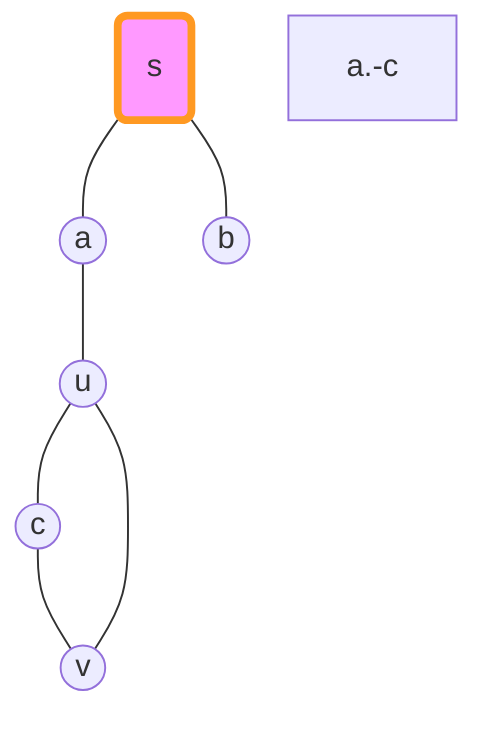

Then in $DFS$ we notice that the adjacent edges of $u$ are not all visited, while in $BFS$ all the adjacent edges of $u$ will be visited.

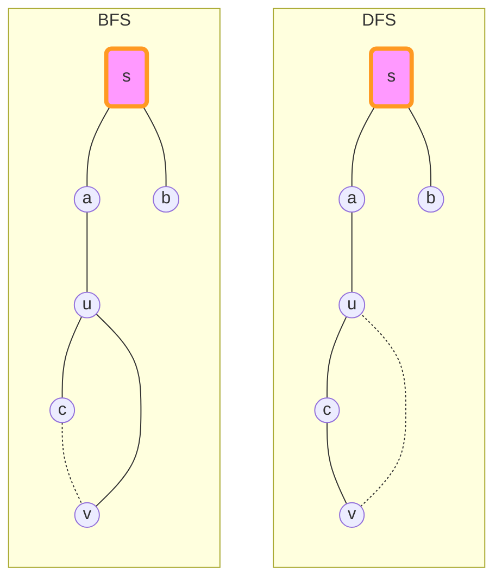

Then we could claim that $G$ is not a good graph, contradicted！

### b)

The statement is not true.

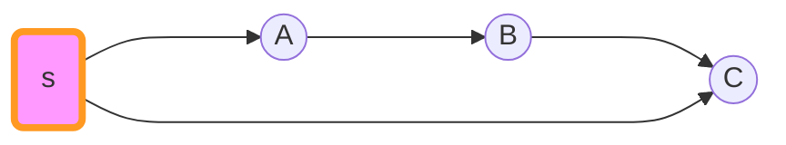

In this case, the topological order is $[s,A,B,C]$, but an ascending distance array obviouly won't end with $C$. However, 

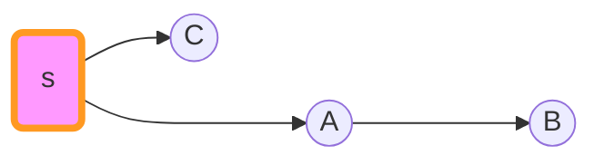

is not only a $BFS$ tree, but also a $DFS$ tree, which means $G$ is a good graph.

### c)

The statement is false. Here is the counterexample:

As we can see, its topological order is $s,v_1,v_2,v_4,v_3$, which is also an ascending order of distances.

However, the $BFS$ tree won't contain edges $(v_1,v_2)$ and $(v_3,v_4)$, while $DFS$ tree must contain one of them, which leads to contradiction. Thus the graph is not good.

# Problem 4

*****

#### ==Algorithm==

> 1. **Initialize**
>
>    $i \leftarrow 0$
>
>    $distance \leftarrow dist[|V|+1]$
>
>    $path \leftarrow pre[|V|+1]$
>
>    $marks \leftarrow marked[|V|+1]$
>
>    $recordedEdge \leftarrow (0, 0)$
>
> 2. **Function** $$findCycle(s):$$
>
>    ​		$V_0 \leftarrow \{\}$
>
>    ​		for $(v,s)\in E$:      *// outer loop*
>
>    ​				$V_0.add(v)$
>
>    ​				$v.root = {v}$
>
>    ​				$dist[v]=1$
>
>    ​		while $V_i$ is not empty:
>
>    ​				for each $u\in V_i$ :
>
>    ​						for each $(u,v) \in E$
>
>    ​						if ($marked[v]=false$):
>
>    ​								$marked[v]=true$
>
>    ​								$pre[v]=u$
>
>    ​								$dist[v]=dist[u]+1$
>
>    ​								add $v$  to $V_{i+1}$
>
>    ​								$v.root = u.root$
>
>    ​						else if ($marked[v]=true$):
>
>    s								if($v.root != u.root$):
>
>    ​										if($dist[v]+dist[u] = 2i-2$):      *// We have found a cycle with length $2i-1$*
>
>    ​												$recordedEdge = (u,v)$
>
>    ​												jump to `Combine`
>
>    ​										$recordedEdge = (u,v)$  *// a cycle with length $2i$* // 这里要加一个flag，这层循环之后直接退出！
>
>    ​				$i\leftarrow i+1$
>
>    ​	   if $(u,v)= (0,0)$: no such cycle, Return
>    
>    ​		`Combine`: combine the path from $s$ to $v$ and $s$ to $u$ to print the circle, Return
>

#### ==Correctness Analysis==

> ==Lemma 1== There exists a cycle in $G$, if and only if during the procedure of $BFS$ we could encounter a vertex $u$ which has been visited.

$\Rightarrow$ If during the procedure of $BFS$ we encounter a vertext $u$ which has been visited, this means there exist two path from $s$ to $u$, combine them and we get a cycle.

$\Leftarrow$ If there exists a cycle $C$ in $G$, we denote the distance from $s$ to $C$ as $d$, then by the symmetry of the circle, we could always find an edge $(u,v)$, with $|dist(s,v)-dist(s,u)| \le1$, which means the next iteration of the $BFS$ we will encounter a vertex which has been visited.

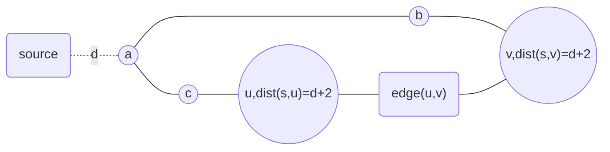

> ==Lemma 2== There exists a cycle containing $s$ in $G$, if and only if there exists an $edge(u,v)$, which satisfies: $\exist u' \in u.root,v' \in v.root $ and $u'!=v'$. Here a vertex $v$'s $root$ is the neighbour of source $s$ who is in the shortest path from $s$ to $v$.  **Note here root could be more than one vertex!** However, later we could see just consider the case when root is a single vertex is enough.

$\Leftarrow$ If there doesn't exist such edge, we are unable to find the cycle containing $s$, obviously.

$\Rightarrow$ From the condition we know that there exists two path: a $u$ to $s$ path and a $v$ to $s$ path, whose second vertices (counting starts from $s$) are different. Thus combine them together with $(u,v)$ we could get a cycle containing $s$.

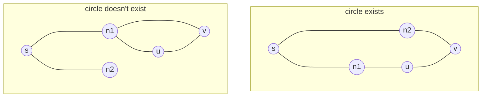

> ==Lemma 3== If  before $i-th$ iteration we haven't found the cycle we want, and we find a cycle containing $s$ at $i-th$ iteration, then it's at least the second shortest cycle containing $s$ with shortest length. 

If  before $i-th$ iteration we haven't found the cycle we want, by lemma 1 and lemma 2, we know that either we haven't encountered a vertex that has been visited, or we haven't found an $edge$ satisfying the condition of lemma 2.

More, we also know that there doesn't exist a circle containing $s$ with length smaller than or equal to $2i$ (we perceive outer loop as iteration 1), by the step-by-step growing length of path in $BFS$ ALG. 

Then in the next iteration, if we found a circle, it's length is either $2i-1$ or $2i$, as we can see from the graph:

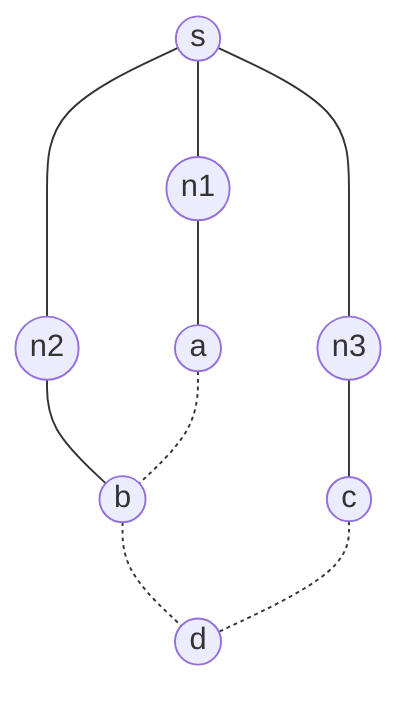

Here dotted line denote the edge visited at $i-th$ iteration.

Given the fact that the length of cycle (if any) found in next iteration is at least $2i+1$, we immediately get the conclusion below:

*==corollary==* 

**if we find a cycle containing $s$ in $i-th$ iteration, then we will find the cycle we want at $i-th$ iteration.**

> ==Lemma 4== In the procedure of the algorithm, the case that "the root of a vertex $u$ has more than one vertex" won't consistently exist

During the procedure of ALG, or at $i-th$ iteration,  if we encounter the case a vertex $u$ seems to have two root, which means:

1. there are two shortest path from $s$ to $u$ with different second vertex (counting starts from $s$), which corresponding to a cycle with length $2i$. 
2. We haven't found the cycle we want at $i-th$ iteration
3. Given the corollary of lemma 3, we know after this iteration, we will find the cycle we want, and we will quit the ALG at this iteration. 

From all these lemmas above, we have already proved the correctness of the ALG.

#### ==Time Complexity==

The same as the analysis in $BFS$, and after considering the additional comparison and value assignment operation, we have a total complexity: $O(C_1|V|+C_2|E|) = O(|V|+|E|)$. Here $C_1$ and $C_2$ are constant.

# Problem 5

*****

==Time : 11 hr==

==Difficulty Score:  4==

==Collaborator： 李佳鑫，陈奕锦，朱鹏翔==

