# Problem 1

*****

### a)

==Bellman-Ford==

> **Function** bellman_ford $(G, S)$
> 		$	\operatorname{dist}[s]=0, \operatorname{dist}[x]=\infty$ for other $x \in V$
> 		while $\exists \operatorname{dist}[x]$ is updated
> 				for each $(u, v) \in E$
> 						$\operatorname{dist}[v]=\min \{\operatorname{dist}[v], \operatorname{dist}[u]+d(u, v)\}$

Assume there is no update at $|V|$ round, which means:
$$
\forall (u,v) \in E,dist(v) \le dist(u)+dist(u,v)
$$
 Here $(u,v)$ denotes there is a directed edge $u\rightarrow v$.

However, if we apply this to the edge constituting negative cycle $C$ 
$$
u_1 \rightarrow u_2 \rightarrow u_3 \rightarrow \cdots \rightarrow  u_n \rightarrow u_1
$$
then we get:
$$
\begin{aligned}
dist(u_2) &\le dist(u_1)+dist(u_1,u_2) \\
dist(u_3) &\le dist(u_2)+dist(u_2,u_3) \\
&\quad \quad \quad \quad\vdots \\
dist(u_n) &\le dist(u_{n-1})+dist(u_{n-1},u_{n}) \\
dist(u_1) &\le dist(u_{n})+dist(u_{n},u_{1}) \\
\end{aligned}
$$
Sum the inequalities above we get:
$$
 \sum_{i=1}^n dist(u_i,u_{i+1})\ge0, (u_{n+1}=u_1)
$$
which contradicts to the fact that the weight of the cycle is negative.

### b)

We construct a graph with $|V|=5$ like below:

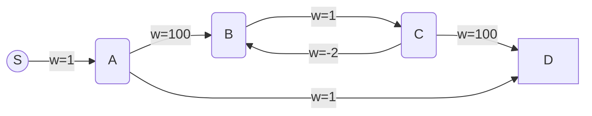

WLOG, we assume the iteration order of the edges is from right to left, and particularly consider the worst case of Bellman-Ford ALG, ==i.e. every update is based on the distance in last iteration.==

==*Iteration 1*==

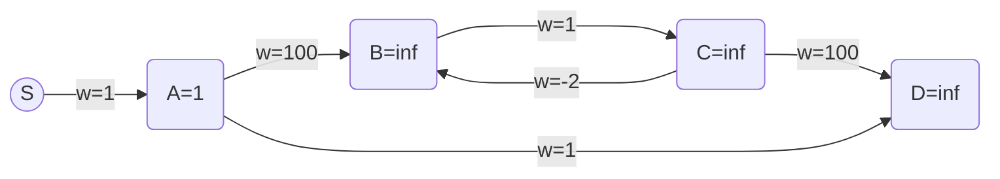

==*Iteration 2*==

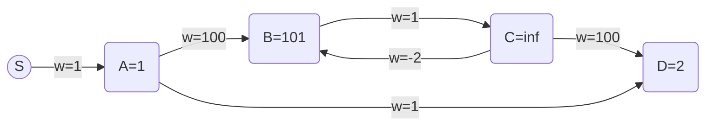

==*Iteration 3*==

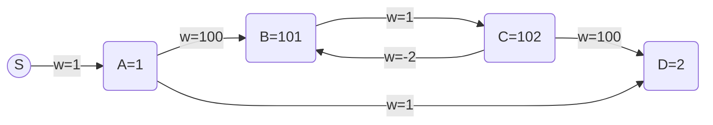

==*Iteration 4*==

*==Iteration 5==*

Terminate after $|V|=5$ rounds.

we find that though there exists a path from $S$ to $D$ containing a negative cycle, for example, $S \rightarrow A \rightarrow B\rightarrow C\rightarrow B\rightarrow C\rightarrow D$, $dist(D)$ is not updated at $|V|-th$ iteration.

### c)

#### ==Algorithm==

> Modified Bellman-Ford
>
> 1. Apply DFS to the source $S$ on $G$ and store all the vertex visited and all it's reversed edge covering these and only these vertices in a new graph $\tilde{G}$
> 2. Apply DFS to a single vertex $t$ on $\tilde{G}$ and store all the vertex visited and all it's edge covering these and only these vertices in another new graph $G'$
> 3. Apply Bellman-Ford ALG to $G'$
>    1. If at the $|V'|$-th round there exists updated vertex then negative cycle exists in the $t$-to-$s$  path.
>    2. o.w. Such path does not exist.

#### ==Correctness Analysis==

Note there DFS to a single vertex $v$ means that we won't enter the outer loop of DFS.

`step 1` exclude the part of the graph which is actually unreachable from S. ==(Later we add condtion that $S$ can reach all points, but I think this addition is unnecessary)==

After `step 2`  we will get a graph $G'$ consists of $t-s$ paths. Because $\forall v \in$ $\tilde{G}$ , we could always starts from it and get to $S$. Given this presiquite, if we apply DFS to $t$ then, we just add $t$ to the head of such path which starts from the neighbor of $t$ and could reach $S$.

==*Lemma*== 

> **If there exists a negative cycle in $G'$, then there exists a t-to-s path with a negative cycle.**

> Proof: Since we know that for any vertex $v$ in $G'$, there exists a path $p_1$ from $v$ to $S$ ($S$ can reach any vertex) and there also exists a path $p_2$ from $t$ to $v$, for $v\in $ negative cycle, we add the cycle to make $p_1 \rightarrow cycle \rightarrow p_2$ is also a $t$ to $s$ path.

****

Then by Bellman-Ford ALG, we could judge whether there exists a negative cycle. Combined with the lemma above and partial symmetry property between $G$ and $G'$ , we could decide if there is an s-t path that contains a negatively weighted cycle in the original graph $G$.

#### ==Time Complexity==

1. `DFS to the source and get reversed graph`   $O(C(|V|+|E|))=O(|V|+|E|)$
2. `DFS to a single vertext t and get a new graph `  $O(C(|V|+|E|))=O(|V|+|E|)$
3. `Bellman-Ford`  $O(|V||E|)$

Here $C$ is a constant.

**Total: **$O(|V||E|)$

# Problem 2

****

Denote $SCC(v)$ as the strong connected component including vertex $v$

#### ==Algorithm==

> 1. Get SCC graph of $G(V,E)$, denote it as $\tilde{G}(V',E')$
> 2. Assign all the weight of $E'$ to be $-1$
> 3. Apply Bellman-Ford to $\tilde{G}$ to get the shortest distance from $SCC(s)$ to $SCC(t)$
>    1. if $dis(SCC(s),SCC(t)) = 1-|V'|$, then such path exists
>    2. o.w. Such path does not exist

#### ==Correctness Analysis==

Since the vertices in the same $SCC$  are already connected, if we get the $SCC$ graph $\tilde{G}(V',E')$ of $G(V,E)$, then we could transform the original problem to "finding the longest path in from $SCC(s)$ To $SCC(t)$, and judge wether the length of the longest path is $|V'|-1$". If so, it means there exists a path covering all the $SCC$ vertices in $\tilde{G}$, since there is no cycle inside a $SCC$ graph. 

Correspondingly, we could follow such path in $\tilde{G'}$ to find the path in $G$ that cover all the vertices.

By assigning the weight of the edge to be $-1$, given that there is no cycle inside a $SCC$ graph, we could use Bellman-Ford to find the shortest path from $SCC(s)$ to $SCC(t)$, which is actually the longest length. By checking whether $dis(SCC(s),SCC(t)) = 1-|V'|$ after $|V'|-1$ rounds,  we could decide wether the length of the longest path is $|V'|-1$.

#### ==Time Complexity==

1. `Get SCC graph`  $O(|V|+|E|)$
2. `Assign weight`  $O(|E|)$
3. `Bellman-Ford`  $O(|V||E|)$

**Total:** $O(|V||E|)$

# Problem 3

******

==Assumption==

> $G$ is free of multiple edge, as assumed in class

### a)

$\Rightarrow$ If $G$ is a tree, then it's DFS and BFS tree must contain all the edges. Since tree has no cycles, which means for $\forall v \in V$ , there exists only one path from $s$ to $v$ (otherwise it will form a cycle), which every path is necessary for reaching all the vertices in the search, thus it's DFS and BFS tree must contain all the edges, i.e. $G$ is a good graph.

$\Leftarrow$ If $G$ is a good graph, we assume there exists an edge $(u,v)$ outside the tree $T(V,E')$. Since $G$ is free of multiple edge, there can't be another edge from $u$ to $v$. This implies three facts:

* There exist two path in $G$ connecting $u$ and $v$, one is $(u,v)$ outside the tree $T(V,E')$, another path $p(V')$ is inside the $T(V,E')$, here $V'$ is the subset of $V$.
* Path(a single edge) $(u,v)$ is shorter than $p(V')$, since the latter contains more than one vertex.
* There exist a cycle containing $u$ and $v$

**To prove the proposition, we actually need to consider the case when ==there are more than one path like $(u,v)$.==**  Let's focus on the cycle it forms, and we could always find the closest cycle to $s$, here distance between a cycle to $s$ is measured by $\min \{dist(u,s) ,u\in cycle\}$. 

We denote this cycle as $C$. If we want to reach $C$ starting from $s$, the "entering point" (denoted as u in the illustration below and will be continually used) is the same no matter in $DFS$ or $BFS$, since the path to the cycle is exclusive, otherwise $C$ is not the closest cycle to $s$, as shown below with **dotted line** representing the existence of another cycle.

> cycle $C$: $u-v-c-u$  is the closest one to $s$ in this graph. The dotted line shows otherwise case.

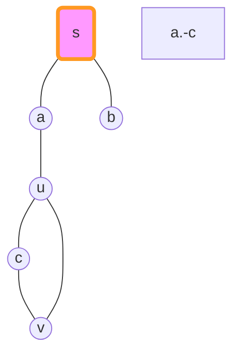

Then in $DFS$ we notice that the adjacent edges of $u$ are not all visited, while in $BFS$ all the adjacent edges of $u$ will be visited.

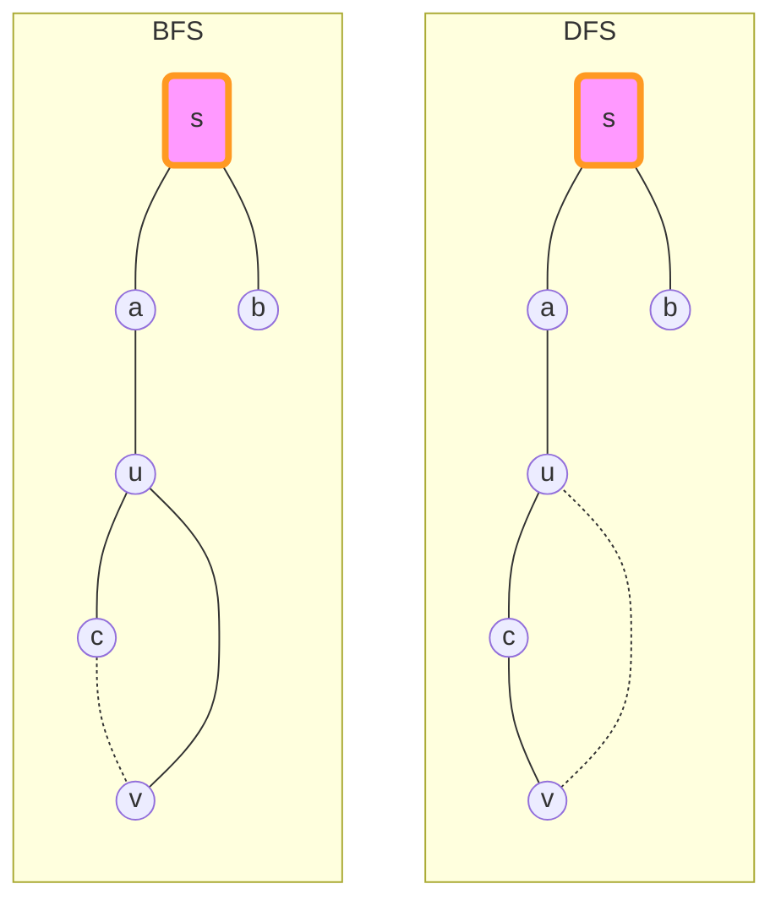

Then we could claim that $G$ is not a good graph, contradicted！

### b)

The statement is not true.

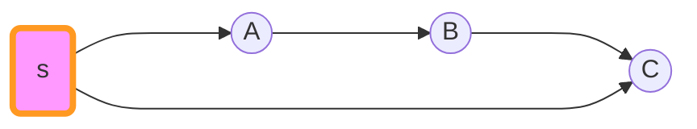

In this case, the topological order is $[s,A,B,C]$, but an ascending distance array obviouly won't end with $C$. However, 

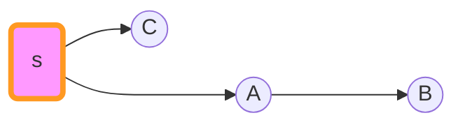

is not only a $BFS$ tree, but also a $DFS$ tree, which means $G$ is a good graph.

### c)

The statement is true. An ascending order of distance is corresponding to the visited order of $BFS$, which is also corresponding to a $BFS$ tree. 

==*observation*==

> For a vertex $v$, if $dist(s,v)=t+1$, then there should exist a vertex $u$, such that $dist(u,v)=t$.
>
> Meanwhile, there exists no other path from $s$ to $v$ with smaller $dist$ than $t+1$.

From the observation above, we then make $u$ the farther of $v$. If the satifying $u$ is more than one, just randomly choose one. Repeat the procedure from the vertex with longest distance from $s$ and to the smallest, we can get a $BFS$ tree.

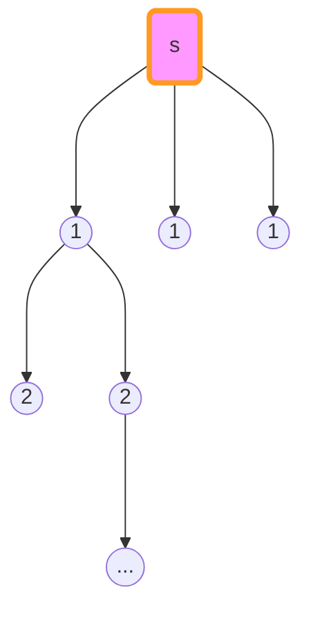

> Here vertex with "..." means **could be more vertices or simply no more**

If $G$ is simply such $BFS$ tree, then $G$ is obviouly good. Now, let's add other edges in $G$ to this $BFS$ tree and discuss different cases. ==We try to prove in each possible case, $G$ is a good graph.==

==Cross Edge 1==

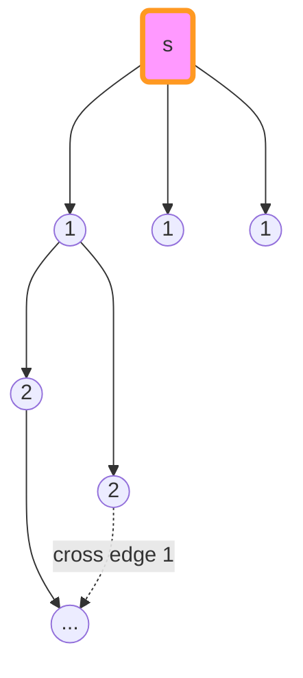

In this case,  the topological order could be still the same with $BFS$ order. And by choosing traversing order, we could make $BFS$ tree as same as $DFS$ tree.

==Cross Edge 2==

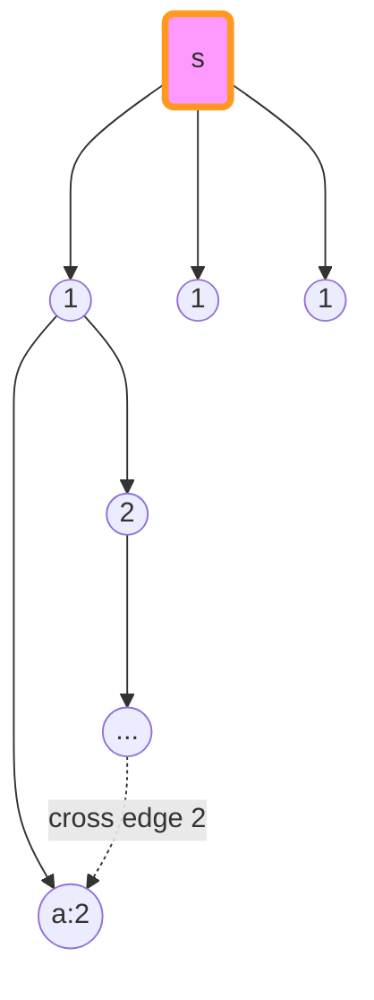

In this case,  the topological order cannot be the same with BFS order because of vertex $a$. It's in the last of topological order while apparently not the last one in BFS order. Such edge doesn't exist in $G$.

==Back Edge== Since we have add the conditions $G$ is acyclic, we could exlude this case.

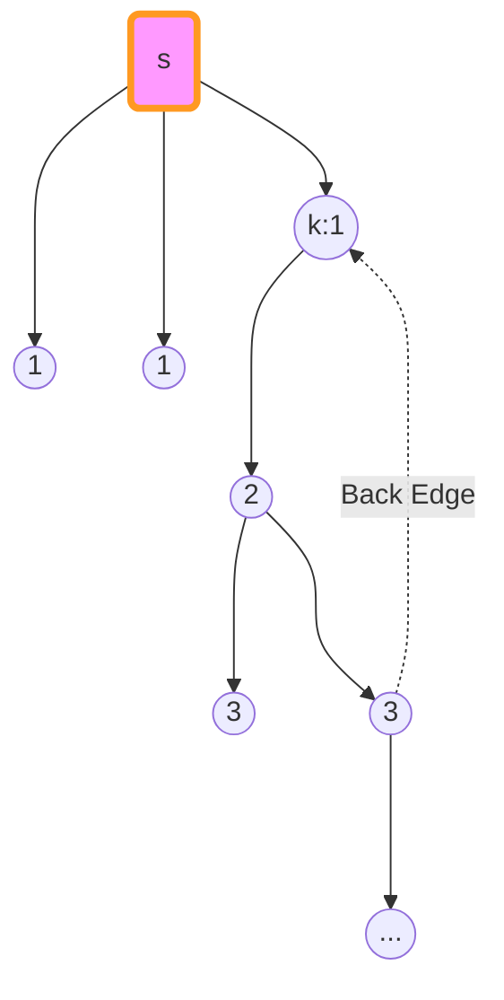

==Forward Edge==

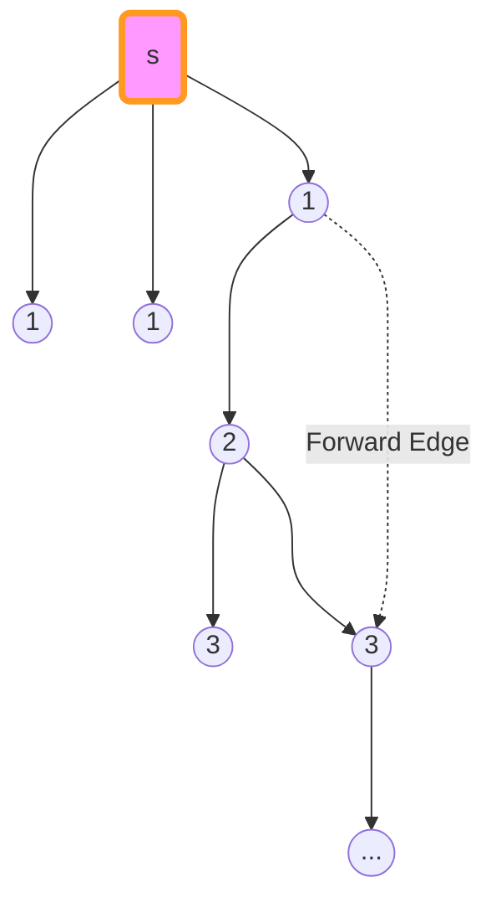

Still, In this case,  In this case,  the topological order could be still the same with $BFS$ order. And by choosing traversing order, we could make $BFS$ tree as same as $DFS$ tree.

By checking all these cases above, we know that in possible cases, we could always find a tree $T(V,E')$ which is a $BFS$ tree meanwhile $DFS$  tree.

# Problem 4

*****

#### ==Algorithm==

> 1. **Initialize**
>
>    $cnt \leftarrow 0,min\leftarrow -inf$
>
>    $len \leftarrow 0$
>
>    $i \leftarrow 0$
>
>    $distance \leftarrow dist[|V|+1]$
>
>    $path \leftarrow pre[|V|+1]$
>
>    $marks \leftarrow marked[|V|+1]$
>
> 2. **Function** $$findCycle(s):$$
>
>    ​		$V_0 \leftarrow \{s\}$
>
>    ​		while $V_i$ is not empty:
>
>    ​				for each $u\in V_i$ :
>
>    ​						for each $(u,v) \in E$
>
>    ​						if ($marked[v]=false$):
>
>    ​								$marked[v]=true$
>
>    ​								$dist[v]=i+1$
>
>    ​								add $v$ to $V_{i+1}$
>
>    ​								$pre[v]=u$
>
>    ​						if ($marked[v]=true$ and $pre[u]!=v$):
>
>    s								if($min < dist[v] + dist[u]$):
>
>    ​										$min = dist[v] + dist[u]$
>
>    ​										==If find a smaller circle, combine the path from $s$ to $v$ and $s$ to $u$ to get a new circle==
>
>    ​				$i\leftarrow i+1$

#### ==Correctness Analysis==

To find a cycle contains $s$, we simply use $BFS$ started with $s$. In the procedure, once we encounter a vertex that has been visited, we know we find a cycle (Note $s$ is marked as visited at the very beginning). 

For any cycle contains $s$, it can be divided in to three paths: $s \rightarrow u,(u, v),s\rightarrow v$, where 
$$
|length(s \rightarrow u) - length(s \rightarrow v)|\le1
$$

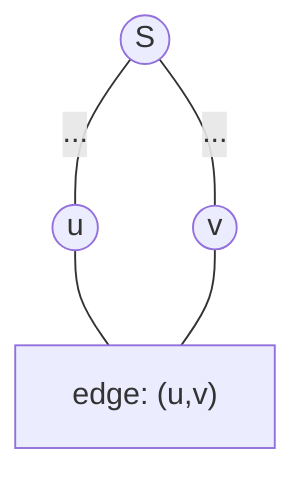

When applying $BFS$, the length of all current paths is increasing with step one, which means for a certain cycle contains $s$, after a finite steps, its path $s \rightarrow u,s\rightarrow v$ will be covered, then we can find this cycle.

By record the minimum length of the cycles in $G$, we can finally get the cycle with minimum length. If we want to print the cycle, just use $pre[|V|+1]$ array to get all the ascendent of $u$ and $v$, add them and its corresponding edges  into a subgraph (a edge set) as well as source vertex $s$ to represent the cycle we find.

#### ==Time Complexity==

The same as the analysis in $BFS$, and after considering the additional comparison and value assignment, we have a total complexity: $O(C_1|V|+C_2|E|) = O(|V|+|E|)$. Here $C_1$ and $C_2$ are constant.

# Problem 5

*****

==Time : 12 hr==

==Difficulty Score:  4==

==Collaborator :==

