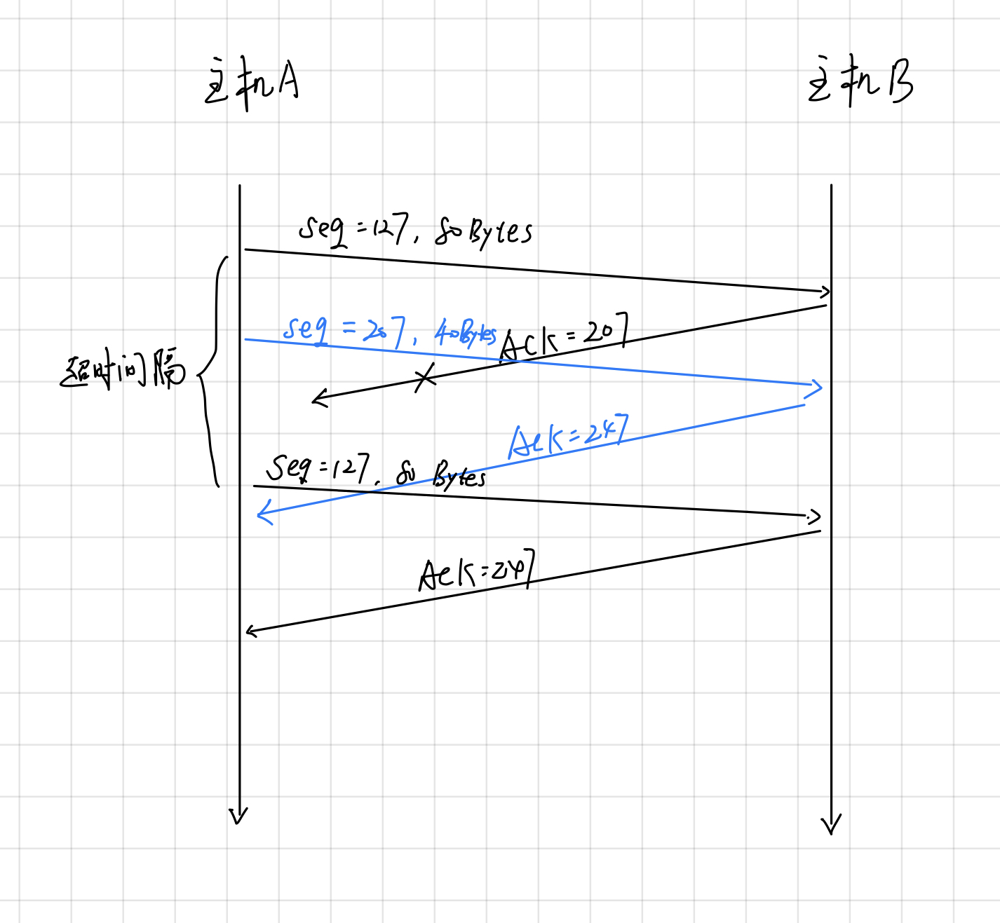

## Ver7 Chapter 3

### p27

### a.

序号：207

源端口号：302

目的端口号：80

### b.

确认号：207

源端口号：80

目的端口号：302

### c.

因为失序，所以确认号仍为127，表示等待第一个报文段

### d.

## p40

### a.

慢启动：0～6，23～26

### b

拥塞避免：6～16，17～22

### c

没有让cwnd降到1，而是减半，所以是根据三个冗余ACK来检测的

### d

cwnd降为1，所以是根据超时检测的

### e

由图中可知，ssthresh的初始值为32左右

### f

当分组丢失时ssthresh被设置为cwnd的一半。当在传输循环16期间检测到丢失时，cwnd的大小为42。因此在第18传输循环期间ssthresh为21。

### g

当在传输循环22期间检测到丢失时，cwnd的大小为29。因此，在第24轮传输中ssthresh为14（下取整）。

### h

在第1次传输期间，数据包1被发送；数据包2-3在第2次传输中发送；数据包4-7在第3传输中发送；数据包8-15在第4个传输中发送；数据包16-31在第5个传输中发送；数据包32-63在第6个传输中发送；数据包64-96被发送在第7次传输循环中。因此，在第7发送循环中发送分组70。

### i

出现丢失，则ssthresh为当前cwnd=8的一半，设置为4；cwnd变为原来的一半，并加上3MSS（3个冗余ACK），变为7.

### j

ssthresh为42的一半21，cwnd变为$2^2=4$

## p45

### a

设窗口大小为$W$,
$$
\begin{aligned}
\frac{\mathrm{W}}{2}+\left(\frac{\mathrm{W}}{2}+1\right)+\ldots+\mathrm{W}
&=\sum_{\mathrm{n}=0}^{\mathrm{W} / 2}\left(\frac{\mathrm{W}}{2}+\mathrm{n}\right)\\&= 
\left(\frac{\mathrm{W}}{2}+1\right) \frac{\mathrm{W}}{2}+\frac{\mathrm{W} / 2(\mathrm{~W} / 2+1)}{2}\\
&=  \frac{\mathrm{W}^2}{4}+\frac{\mathrm{W}}{2}+\frac{\mathrm{W}^2}{8}+\frac{\mathrm{W}}{4} \\
&= \frac{3}{8} \mathrm{~W}^2+\frac{3}{4} \mathrm{~W}
\end{aligned}
$$
则丢包率为：
$$
\frac{1}{\frac{3}{8} \mathrm{~W}^2+\frac{3}{4} \mathrm{~W}}
$$

### b

当$W$足够大时， $\frac{1}{L}=\frac{3}{8}W^2 +\frac{3}{4}W \approx \frac{3}{8}W^2$, $W \approx \sqrt{\frac{8}{3L}}$
$$
\frac{3}{4}\frac{W}{RTT}=\frac{3}{4} \sqrt{\frac{8}{3 \mathrm{~L}}} \frac{\mathrm{MSS}}{\mathrm{RTT}}=\frac{1.22 \cdot \mathrm{MSS}}{\mathrm{RTT} \cdot \sqrt{\mathrm{L}}}
$$

### p52

记 $t=1+a$, 令 $\frac{W}{2}\cdot \frac{1-t^k}{1-t}=W\rightarrow k \approx \log_{t}2$

所需时间为
$$
T=k \cdot RTT
$$
a确定时，上式为一个常数，显然与TCP平均吞吐量无关。
