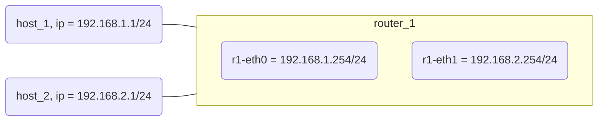

[TOC]


# 指令学习

> `mn --link=tc,bw=10,delay='1ms',loss=0 `设置链路属性

`--link`：链路属性可以是默认Link及TCLink。将链路类型指定为TC后，可以进一步指定具体参数。具体参数命令显示如下：

```shell
sudo mn --link tc,bw=[bandwidth],delay=[delay time],loss=[loss rate],max_que_size=[queue size]
```

bw表示链路带宽，使用Mbit/s为单位表示；延迟delay以字符串形式表示，如‘5ms’、‘100us’和‘1s’；loss 表示数据分组丢失率的百分比，用 0～100的一个百分数表示；max_queue_size表示最大排队长度，使用数据分组的数量表示。

****

> **iperf命令** 是一个网络性能测试工具。

iperf可以测试TCP和UDP带宽质量。iperf可以测量最大TCP带宽，具有多种参数和UDP特性。iperf可以报告带宽，延迟抖动和数据包丢失。利用iperf这一特性，可以用来测试一些网络设备如路由器，防火墙，交换机等的性能。

Node sta2给sta1发送信息：iperf -s命令

```
iperf -s -p 5566 -i 1
```

> -s表示发送数据包
> -p表示端口号
> -i表示间隔的时间（单位：s）

sta1监听5566端口，接受信息：iperf -c命令

```
perf -c 10.0.0.3 -p 5566 -t 15
```

> -t表示持续接受15s的消息
>
> 10.0.0.3 是 sta1的IP

****
```bash
h1 ping -c 1000 i 0.01 h2
```

```plain
-d 使用Socket的SO_DEBUG功能。
-c <完成次数> 设置完成要求回应的次数。
-f 极限检测。
-i<间隔秒数> 指定收发信息的间隔时间。
-I<网络界面> 使用指定的网络接口送出数据包。
-l<前置载入> 设置在送出要求信息之前，先行发出的数据包。
-n 只输出数值。
-p<范本样式> 设置填满数据包的范本样式。
-q 不显示指令执行过程，开头和结尾的相关信息除外。
-r 忽略普通的Routing Table，直接将数据包送到远端主机上。
-R 记录路由过程。
-s<数据包大小> 设置数据包的大小。
-t<存活数值> 设置存活数值TTL的大小。
-v 详细显示指令的执行过程。
-w <deadline> 在 deadline 秒后退出。
-W <timeout> 在等待 timeout 秒后开始执行。
```


# 1. 简单拓扑设计

## 实验过程

> 使用 iperf 进行测试，一个终端机作为客户端，一个终端机作为服务器端，在服务器端每秒输出测试报告，在客户端去连接服务器端，观察输出报告。

`h1 server`


`h2 client`


> 将 loss 设为 1，连接到环境后，使用 h1 ping -c 1000 i 0.01 h2，重复多次实验，观察总的丢包率。

*Time 1*


*Time 2*


*Time 3*


==Average packet loss: 3.46%==

## 问题 

> 观察输出报告，回答为什么 Bandwidth 的值只会接近于 10，而到达不了

1. 物理带宽限制：由于硬件限制、网络拥塞等原因，实际链路的物理带宽可能小于设定的10
2. 虚拟化软件限制: 在使用mininet这类虚拟化软件构建网络时，由于虚拟化的特性，在数据包的传输过程中可能出现delay, jitter等问题，从而影响数据的实际到达时间和带宽。
3. 系统资源限制：在进行测试时，如果系统的CPU、内存等资源已经达到负载极限，可能会导致数据传输的速度变慢，从而影响带宽测试结果。
4. 传输协议限制：不同的传输协议对带宽的利用率不同，例如TCP是一种流控协议，对带宽的利用效率可能比UDP低，所以在使用不同的传输协议时，测试结果也会有所差异。

> 观察丢包率，回答丢包率大概为多少，为什么不是设置的 1%

根据三次实验结果可知，平均丢包率约为3.46%。关于为什么loss并非设置值的可能原因：

1. 丢包率是指在指定的时间内，发出去的数据包中未到达目的地的比例。如果在发送数据包时，数据包的发送速度过快超过了设备处理能力，就有可能会丢失部分数据包。因此，可能需要适当降低发送速度。
2. 运行Mininet的操作系统对网络性能的影响。网络驱动程序的性能可能会受到限制，导致网络丢包率升高。

> 在第一次用 h1 ping h2 时，使用 wireshark 抓包，观察 其中的 ARP 协议，回答为什么询问的时候 destination 显示的是 broadcast


为了发送文件，服务器端需要从客户端的IP地址确认客户端的MAC地址，具体方式是通过ARP协议询问子网上所有的路由与主机的ARP表，以确定对应要解析的IP地址对应的MAC地址。正如wireshark `info` 里说的那样，通过广播broadcast，h1服务器询问所有子网内的路由和主机是否有包含目的IP的ARP表，从而获得h2客户端的MAC地址。

# 二. 使用 python 建立拓扑

## 实验过程

> 首先使用 1.py 创建网络拓扑，然后环境中测试 ping 封包，观察现象


> 在 1.py 的基础上，我们增加一个 r1(需自己实现代码)， 作为 2.py，创建网络拓扑，并再次测试 ping 封包，观 察现象


## 问题

> 请对上述的命令进行简要介绍

`ifconfig`：该命令用于查看和配置网络接口。'ifconfig eth0' 可以查询第一个接口的设置信息，'ifconfig eth0 down' 则是关闭此网卡。

`ip addr add`：该命令用于添加 IP 地址，例如 'ip addr add 192.168.1.1/24 dev eth0' 表示为网卡 eth0 配置 IP 地址为 192.168.1.1，掩码为 /24。

在命令 "ip addr add 192.168.2.1/24 brd + dev h2-eth0" 中，`brd` 是参数之一，表示为该网络接口设置一个广播地址，"+" 表示由 Linux 内核自动生成。dev 参数则是要添加 IP 的网络接口名称。

具体来说，“brd” 后面的“+”代表在内核中自动计算该网段的广播地址，并将其配置到网络接口上。使用广播地址可以确保数据包被发送到同一物理网络中的所有主机，使得通信更加高效。

`ip route add`：该命令用于添加路由表规则，通常用于设置默认路由，例如 'ip route add default via 10.0.1.1' 表示所有无法匹配的数据包都将通过目标地址为 10.0.1.1 的网关转发出去。

`echo`：该命令用于输出指定字符串或者文件重定向，例如 'echo 1 > /proc/sys/net/ipv4/ip_forward' 表示将 1 输出到 proc 文件系统下的 ipv4 目录中。

> 请你画出 1.py 和 2.py 构建的网络拓扑结构，包括端口 ip

**py.1**


**py.2**



其中，h1 和 h2 的 IP 地址分别为 192.168.1.1/24 和 192.168.2.1/24，r1 的 eth0 和 eth1 分别对应 h1 和 h2 网段的 IP 地址。


# 3. NAT 转换

## 实验过程

> 利用 python 脚本，在 2.py 的基础上，编写 3.py，其拓 扑结构如下图所示，并设置各元件，是的 h1 和 h2 能够 相互 ping 通


> 在 3.py 的基础上，我们编写 4.py，在路由器 1 中加入 NAT 转换

## 问题

> 使用 wireshark 对上面两个拓扑中 h1 ping h2 进行抓包， 观察封包的不同

从以下两个拓扑的抓包情况可以看出，有以下几点不同：

* 由于外网和内网的划分，Source和Destination的IP已经不同
* 未使用NAT前，需要四个使用ARP的数据报来传输信息，使用NAT后，只需要两个

-**py.3**

`Capturing from h1-eth0`


`Capturing from h2-eth0`


-**py.4**

```bash
h1 ping h2
```

`Capturing from h1-eth0`


`Capturing from h2-eth0`


> 请你根据网络拓扑和网络封包对上面两个拓扑 h1 和 h2 互通信的过程进行描述


内网中的主机h1想要向IP为22.1.1.1/24的主机h2发送文件，首先通过ARP获取h2主机IP对应的MAC地址。然后h1主机指派了某个端口，然后先将数据报发送到LAN中。NAT路由器，也即r1，会为数据报分配新的端口，然后将源IP替代为一个外网的IP地址。然后将数据报转发到router2，最后发送到h2主机上。

# 四. 子网和掩码

## 实验过程

拓扑结构1


拓扑结构2


## 问题

> 上面两个拓扑结构中 h1 与 h2 的连通性如何，并解释原因

从实验过程的图中可以看出，拓扑结构1中h1和h2可以连通，拓扑结构2中h1和h2无法连通。

原因是拓扑结构1中的两个主机在同一个子网中。同一个子网中的两个主机可以使用 Ping 命令互相通信，这是因为它们具有相同的网络前缀，并且使用相同的默认网关进行通信。在一个局域网（LAN）中，所有的主机都连接到同一个交换机或路由器上，被视为同一个网络。当两台主机想要互相通信时，它们可以通过交换机或路由器来查找对方的 MAC 地址和 IP 地址，然后将数据包发送给对方。因此，只要两台主机的 IP 地址位于同一个子网，并且共享同一个默认网关和交换机，它们就可以互相连通并交换信息。

而拓扑结构2中的两个主机不在一个子网内，从而无法连通。

> 加入一个路由器，使得不能相互通信的 h1 和 h2 可以相 互通信

具体见代码`subnet3.py`


# Bug记录

## Bug1

```
router.cmd('echo 1 > /proc/sys/net/ipv4/ip_forward')
```

设置router的时候，不能没有这一行代码，否则无法ping通

## Bug2

使用wireshark抓包，但是没有发现相应的网卡接口。这是因为wireshark要在设备的xterm里打开！


# 补充资料

在网络中，数据包在传输过程中可能会遇到各种各样的问题，例如链路带宽限制、延迟、丢包等。其中，“延迟”和“时延抖动（jitter）”是常见的影响因素。

mininet是一款轻量级的网络模拟器，使用它可以方便地搭建虚拟网络环境并进行相关测试。在mininet模拟过程中，由于网络拓扑结构和数据传输方式等因素的复杂性，会导致一些网络性能上的问题，如“延迟”和“时延抖动”。

1. 延迟：指数据包从发送方到接收方所需的时间。在mininet模拟的网络环境中，如果模拟拓扑结构、网络设备等配置不当，或者系统资源紧张等原因，都可能导致数据包的延迟增加，并影响网络应用的实时性和用户体验。
2. 时延抖动：指相邻两个数据包之间的延迟差异。在网络传输过程中，数据包的到达时间受多种因素的影响，如网络拥塞、路由选择等，从而导致数据包到达的时间存在波动。这种波动即称为“时延抖动”。时延抖动的大小和变化趋势会直接影响到多媒体应用（如VoIP、视频会议等）的质量和用户的体验。


# 参考链接

> 1. https://www.cnblogs.com/lht333/p/16695664.html
> 2. https://blog.csdn.net/ZhrXg/article/details/126833559
> 3. https://blog.csdn.net/ZhrXg/article/details/126833559
> 4. [Linux ping指令](https://www.runoob.com/linux/linux-comm-ping.html)
> 5. [ifconfig 用法总结](https://blog.csdn.net/hyfstyle/article/details/90899955) 


