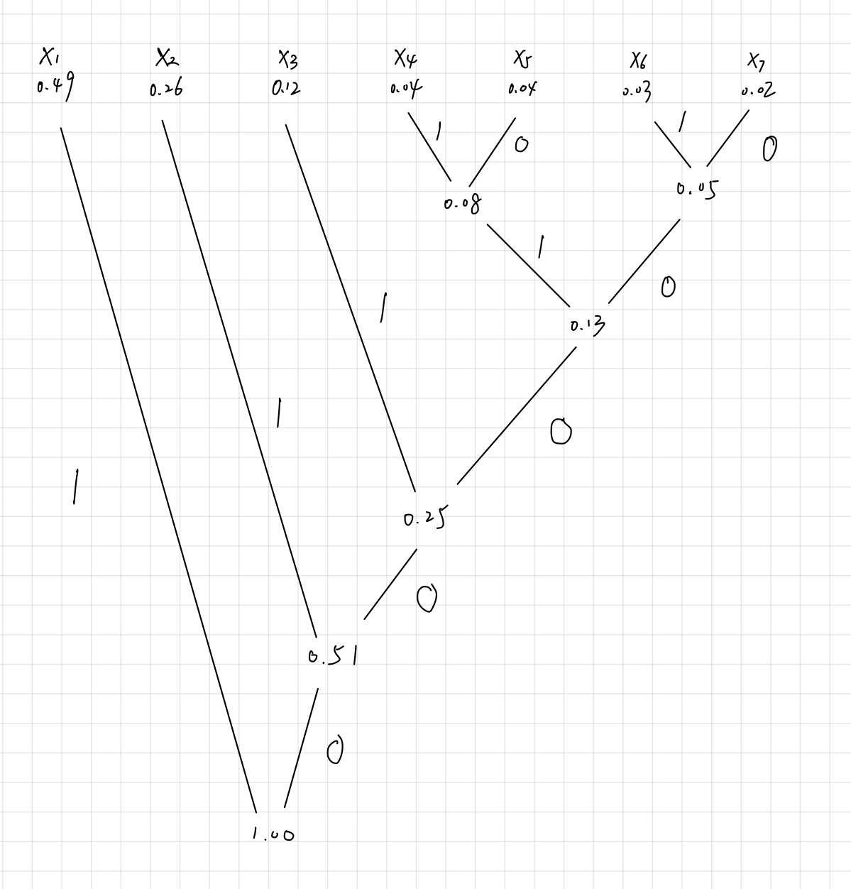
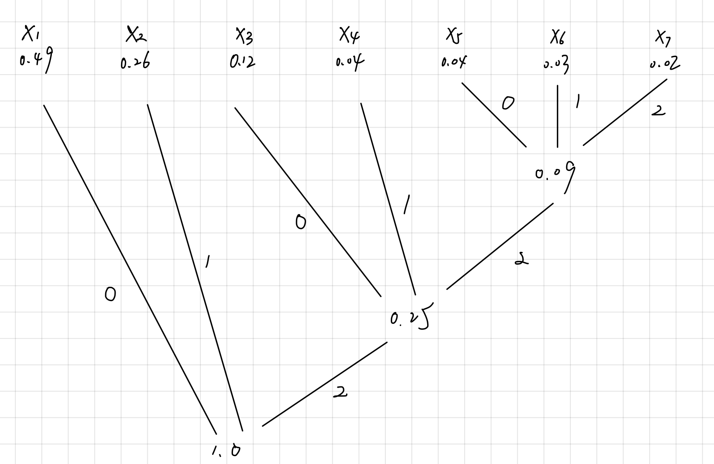
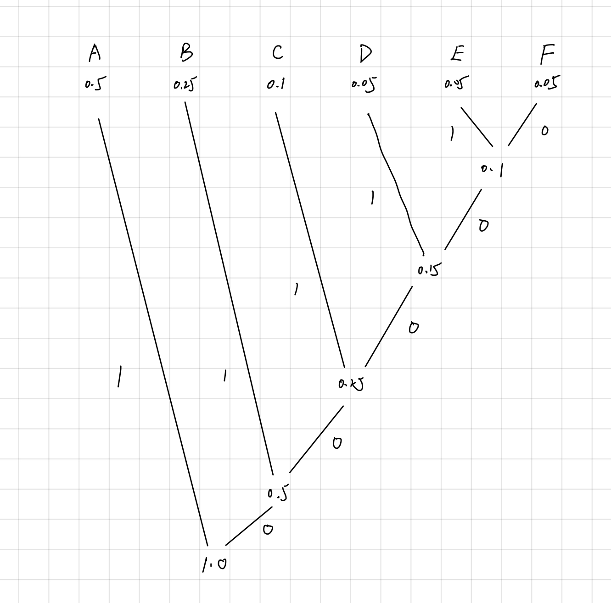
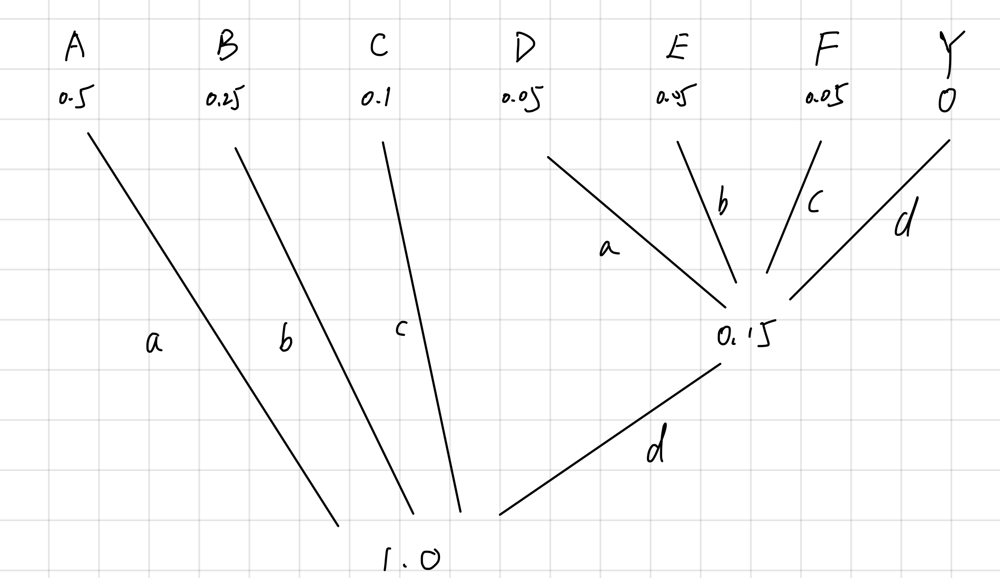
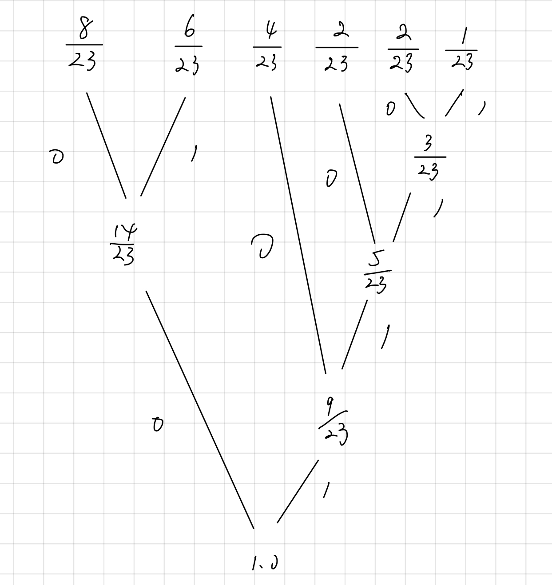

# Homework 5

[TOC]

## 5.3 Slackness in the Kraft Inequality

let $l=$ {$l_1,l_2,\cdots,l_m$}. Then for a certain codeword $D^*_i$ with length $l_i$, there are $D^{l-l_i}$ code string with length $l$ which  take $D^*_i$ as its prefix.

If we sum through the codewords, then we have 
$$
\sum_{i=1}^m D^{l-l_i}=D^l\sum_{i=1}^m D^{-l_i}< D^l\text{,  (Kraft Inequality)}
$$
Therefore, there exist $D_l^*$ with length $l$ which don't take any of the codeword as its prefix, thus cannot be decoded as into sequences of codewords. Furthermore, any $D^*$ with greater length than $l$ and take $D_l^*$ as prefix cannot be decoded as into sequences of codewords, i.e. there exists arbitrary long sequences that cannot be decoded as into sequences of codewords.

## 5.4 Huffman Coding

### (a)

$p=D^{-l_i}$, here $\mathcal{D}=${0,1}, $D=2$.

| $x_i$ | Codeword | Length($l_i$) | Probability($p_i$) |
| :---: | -------- | ------------- | ------------------ |
| $x_1$ | 1        | 1             | 0.49               |
| $x_2$ | 01       | 2             | 0.26               |
| $x_3$ | 001      | 3             | 0.12               |
| $x_4$ | 00011    | 5             | 0.04               |
| $x_5$ | 00010    | 5             | 0.04               |
| $x_6$ | 00001    | 5             | 0.03               |
| $x_7$ | 00000    | 5             | 0.02               |

### (b)

$$
L(C)=\sum_{i=1}^7 p_il_i=2.02\text{ bits}
$$

### (c)

Since the number $n$ of $x_i$ to be decoded should satisfies:
$$
n=1+k(D-1)=1+2k,k\in N
$$
Here $n=7=1+2\cdot3$ , therefore we don't need dummy symbols.

| $x_i$ | Codeword | Length($l_i$) | Probability($p_i$) |
| :---: | -------- | ------------- | ------------------ |
| $x_1$ | 0        | 1             | 0.49               |
| $x_2$ | 1        | 1             | 0.26               |
| $x_3$ | 20       | 2             | 0.12               |
| $x_4$ | 21       | 2             | 0.04               |
| $x_5$ | 220      | 3             | 0.04               |
| $x_6$ | 221      | 3             | 0.03               |
| $x_7$ | 222      | 3             | 0.02               |

## 5.7 Huffman 20 questions

### (a)

Actually, to find the set of defective objects is equal to get the sequence $X_1,X_2,\cdots,X_n$, where $X_i=1$ means i-th object is good, $X_i=0$ means defective. Intuitively, the optimal questions set corresponds to a Huffman code for the sequence, as we should use smallest number of questions to derive the most possible case, where $X_1,X_2,\cdots,X_n$ are all 1, with probability $\prod_{i=1}^n p_i$$(p_i > \frac{1}{2})$, while using largest number of questions for the least possible one, where $X_1,X_2,\cdots,X_n$ are all 0, with with probability $\prod_{i=1}^n (1-p_i)$.

$\therefore$ The lower bound of the average number of questions is the entropy of the sequence:
$$
H(X_1,X_2,\cdots,X_n)
$$
$\because$ {$X_i$} are independent, 

$\therefore$
$$
H(X_1,X_2,\cdots,X_n)=\sum_{i=1}^nH(X_i)=\sum_{i=1}^nH(p_i)
$$

### (b)

As we mentioned in part (a), the most possible case is $X_1,X_2,\cdots,X_n$ are all 1, with probability $\prod_{i=1}^n p_i$$(p_i > \frac{1}{2})$, while the least possible case is$X_1,X_2,\cdots,X_n$ are all 0, with with probability $\prod_{i=1}^n (1-p_i)$.

Given that $p_1 > p_2 >\cdots>p_n > \frac{1}{2}$, then 2 least possible sequences are $0000\cdots00$ and $0000\cdots01$, **which are also the two sets that we are to distinguish**. Therefore, the last question we ask should be "Is $X_n$ defective?" in words.

### (c)

As we know the optimal question set is corresponding to a Huffman code, thus the upper bound of the average number of questions is the upper bound on the average length of the Huffman code, which is
$$
H(X_1,X_2,\cdots,X_n)+1=\sum_{i=1}^nH(p_i)+1
$$

## 5.8 Simple Optimum Compression of Markov source

### (a) conditional case

By designing Huffman code for each $C_i$, we could get a possible pattern below:

|       | $S_1$ | $S_2$ | $S_3$ | Average Length $L(C_i)$                                |
| ----- | ----- | ----- | ----- | ------------------------------------------------------ |
| $C_1$ | 0     | 10    | 11    | $\frac{1}{2}+\frac{1}{4}\cdot 2\cdot 2=1.5\text{bits}$ |
| $C_2$ | 10    | 0     | 11    | $\frac{1}{2}+\frac{1}{4}\cdot 2\cdot 2=1.5\text{bits}$ |
| $C_3$ | -     | 1     | 0     | $\frac{1}{2}+\frac{1}{2}=1\text{bits}$                 |

### (b) unconditional case

We first find the stationary distribution on the state.By solving
$$
\mu=\mu\left[\begin{array}{ccc}
1 / 2 & 1 / 4 & 1 / 4 \\
1 / 4 & 1 / 2 & 1 / 4 \\
0 & 1 / 2 & 1 / 2
\end{array}\right]
$$
we get $\mu=(\frac{2}{9},\frac{4}{9},\frac{1}{3})$. Then the average length should be:
$$
L=\frac{2}{9}\cdot1.5+\frac{4}{9}\cdot 1.5+\frac{1}{3}\cdot1= \frac{4}{3}\text{bits}
$$

### (c) entropy rate

$$
\begin{aligned}
H(\mathcal{U})&=-\sum_{i j} \mu_i P_{i j} \log P_{i j}\\&=-[\frac{2}{9}\cdot(\frac{1}{2}\log \frac{1}{2}+\frac{1}{4}\log \frac{1}{4}+\frac{1}{4}\log \frac{1}{4})\\&+\frac{4}{9}\cdot(\frac{1}{2}\log \frac{1}{2}+\frac{1}{4}\log \frac{1}{4}+\frac{1}{4}\log \frac{1}{4})\\&+\frac{1}{3}\cdot(\frac{1}{2}\log \frac{1}{2}+\frac{1}{2}\log \frac{1}{2})] \\
&=\frac{4}{3} \text{bits}
\end{aligned}
$$

Therefore, the entropy rate of Markov chain is equal to the average code length, which can be explained as 

$L(C_i)=H(X_2|X_1=S_i)$, showing that the maximal compression is achieved.

## 5.9 Optimal code lengths that require one bit above entropy

Consider a distribution: $P(X=1)=1-\epsilon,P(X=0)=\epsilon$

We let $\epsilon \rightarrow 0^+$, then $H(X)\rightarrow 0$, while in the process the length of code is always $1$.

## 5.13 Twenty questions

Since 
$$
H(X)\le L^* <H(X)+1
$$
And 
$$
H(X)\le \log|\mathcal{X}|
$$
We know that the lower bound of the objects in the universe is $2^{37.5}$, because:
$$
|\mathcal{X}|\ge x^{H(X)}>2^{L^*-1}=2^{37.5}
$$

## 5.16 Huffman codes

### (a) Binary

| $x_i$ | Codeword | Length($l_i$) | Probability($p_i$) |
| :---: | -------- | ------------- | ------------------ |
|  $A$  | 1        | 1             | 0.5                |
|  $B$  | 01       | 2             | 0.25               |
|  $C$  | 001      | 3             | 0.1                |
|  $D$  | 0001     | 4             | 0.05               |
|  $E$  | 00001    | 5             | 0.05               |
|  $F$  | 00000    | 5             | 0.05               |

The average length is 2 bits.

### (b) Quaternary

Since the number of values should satisfy
$$
n=1+k(D-1)
$$
Here $D=4,k\in N$. As $n=6$ doesn't satisfy the equation, we should add a dummy symbol with possibility 0.

| $x_i$ | Codeword | Length($l_i$) | Probability($p_i$) |
| :---: | -------- | ------------- | ------------------ |
|  $A$  | a        | 1             | 0.5                |
|  $B$  | b        | 1             | 0.25               |
|  $C$  | c        | 1             | 0.1                |
|  $D$  | da       | 2             | 0.05               |
|  $E$  | db       | 2             | 0.05               |
|  $F$  | dc       | 2             | 0.05               |
|   Y   | dd       | 2             | 0                  |

The average length is 1.15 bits.

### (c)

$a:00,b:01,c:10,d:11$

| $x_i$ | Codeword | Length($l_i$) | Probability($p_i$) |
| :---: | -------- | ------------- | ------------------ |
|  $A$  | 00       | 2             | 0.5                |
|  $B$  | 01       | 2             | 0.25               |
|  $C$  | 10       | 2             | 0.1                |
|  $D$  | 1100     | 4             | 0.05               |
|  $E$  | 1101     | 4             | 0.05               |
|  $F$  | 1110     | 4             | 0.05               |
|   Y   | 1111     | 4             | 0                  |

The average length is 2.3 bits.

### (d)

As proved in the lecture "Optimal Codes", we know
$$
L^* < H_D(X)+1
$$
Obviously, $2L_Q=L_{QB},H(X)=2H_4(X)$, therefore
$$
 L_{QB} <2H_4(X)+2=H(X)+2
$$
Since $L_H \ge H(X)$, therefore $L_{QB}<L_H+2$

For the lower bound, given that the binary code constructed from the quaternary Huffman code is also prefix code,  which cannot be more optimal than huffman code. Thus $L_H \le L_{QB}$.

### (e)

Consider a random variable with four possible value and is uniformly distributed. Then the quaternary code is $a,b,c,d$, and the binary code constructed from it is $00,01,10,11$, which is also the optimal code since it's also the huffman code.

### (f)

Consider a binary huffman code for the random variable $X$, and for all the codeword with odd length, we append a zero to its end to make it even. Obviously, it's still a prefix code. And apply the reversal construction process as in part (c), we can get a quarternary prefix code, with length:
$$
L_{BQ}=\frac{1}{2}(\sum_{i} p_il_i^*+\sum_{l_i \text{ is odd}}p_i) \le \frac{L_H+1}{2}
$$
Beacause $L_Q$ is the average length of quarternary huffman code,  $L_Q \le L_{BQ}$

$\therefore$
$$
L_{QB}=2L_Q \le 2L_{BQ} \le L_H+1
$$
The example where the bound is tight could be: a random variable only takes two values with equal possibility. It's binary huffman code is $0,1$, with $L_H=1$; it's quaternary huffman code is $a,b$, and the binary code constructed on it is $00,01$, with $L_{QB}=2$. The bound is tight.

## 5.28 Shannon code

### (a) prefix-free

 Since we know that $l_i=\left\lceil\log \frac{1}{p_i}\right\rceil$

Therefore,
$$
\log \frac{1}{p_i} \leq l_i<\log \frac{1}{p_i}+1
$$
Take expectation of each side, we have
$$
H(X) \le L< H(X)+1
$$
To prove prefix code, we notice that:
$$
2^{-l_i}\le p_i < 2^{1-l_i}
$$
Then $\forall i \in$ {$1,2,3,\cdots,m - 1$}, and $\forall j > i, j \le m$, we have:
$$
F_j-F_i \ge 2^{-l_i}
$$
Since the codeword $C_i$ extracted from $F_i$ only have $l_i$ digits, we know that at least one digit in $F_j$ ranging from the first digit to the $l_i$ digit is different from that in $F_i$, which means $C_i$ cannot be the prefix of $C_j$. Therefore, the code constructed by this process is prefix-free.

### (b) Construction

| Probability | $l_i$ | Rounded $F_i$ in decimal | Rounded $F_i$ in binary | Codeword |
| ----------- | ----- | ------------------------ | ----------------------- | -------- |
| 0.5         | $1$   | 0                        | 0.0                     | 0        |
| 0.25        | $2$   | 0.5                      | 0.10                    | 10       |
| 0.125       | $3$   | 0.75                     | 0.11                    | 110      |
| 0.125       | $3$   | 0.875                    | 0.111                   | 111      |

## 5.32 Bad wine

### (a)

Obviously the optimal strategy is to taste the wine with in the decending order that the possibility of the wine to be bad.

In this case, the expected number of tastes required is:
$$
\begin{aligned}
\sum_{i=1}^6 p_i l_i & =1 \cdot \frac{8}{23}+2 \cdot \frac{6}{23}+3 \cdot \frac{4}{23}+4 \cdot \frac{2}{23}+5 \cdot \frac{2}{23}+5 \cdot \frac{1}{23} \\
& =\frac{55}{23} \\

\end{aligned}
$$

### (b)

The first bottle to be tasted is the one with probability $\frac{8}{23}$

### (c)

It's the application of binary huffman code.

From the image above we know that the expected number of tastes required is:
$$
\begin{aligned}
\sum_{i=1}^6 p_i l_i & =2 \cdot \frac{8}{23}+2 \cdot \frac{6}{23}+2 \cdot \frac{4}{23}+3 \cdot \frac{2}{23}+4 \cdot \frac{2}{23}+4 \cdot \frac{1}{23} \\
& =\frac{54}{23} \\
\end{aligned}
$$
As for why not use D($D\ge 3$) huffman code, if we tastes the mixture of 3 or more bottles, this process could actually be divided into the process like: tastes one bottle of them and decide whether to taste the remain. It's essentially a dichotomy process with weight, where binary huffman code is sufficient and necessary.

### (d)

According to the analysis in part (c), the first mixture to be tasted is the mixture of bottle 1 and 2.

