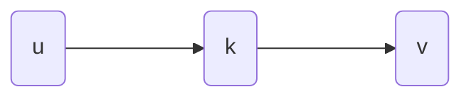

#算法 

## All Pair Shortest Path
> 我们假设没有负环
### Natural Definition
$$d[k,u,v]=\min_{(s,v)\in E}\{d[k-1,u,s]+d[v,s]\}$$

### Floyd-Warshall
把u到v的最短路的<mark style="background: #FFB86CA6;">中间节点</mark>限制一下，只允许使用前k个点，最短路能优化到多少。

```pseudo

    \begin{algorithm}
    \caption{Quicksort}
    \begin{algorithmic}
      \PROCEDURE{Quicksort}{$A, p, r$}
        \IF{$p < r$}
          \STATE $q = $ \CALL{Partition}{$A, p, r$}
          \STATE \CALL{Quicksort}{$A, p, q - 1$}
          \STATE \CALL{Quicksort}{$A, q + 1, r$}
        \ENDIF
      \ENDPROCEDURE
      \PROCEDURE{Partition}{$A, p, r$}
        \STATE $x = A[r]$
        \STATE $i = p - 1$
        \FOR{$j = p$ \TO $r - 1$}
          \IF{$A[j] < x$}
            \STATE $i = i + 1$
            \STATE exchange
            $A[i]$ with $A[j]$
          \ENDIF
        \STATE exchange $A[i]$ with $A[r]$
        \ENDFOR
      \ENDPROCEDURE
      \end{algorithmic}
    \end{algorithm}

```

## Traveling Salesman Problem(TSP)
> 定义：图为完全图


定义 $f[S,u,v]$, S是一个集合，u到v的经过S中所有点的路径中最短的。





$$f[S,u,v]=\min_{k\in S}f[S-\{k\},u,k]+d(k,v)$$
>其实只需要研究从任意一个起点开始的答案，因为最小环从任何一个起点出发是一样的。

>[!tips] 用一个二进制数来代表集合Set，从而可以储存为下标。否则set不能被用于下标。

## Solve Problem on Trees
****
### Maximize Independents Set on Trees

需要的子问题：所有子树上的independent Set（可以用dp的本质是sibling之间没有边，所以可以相加）
$f[v]$ 以v为根的子树的情况。

Charging Argument更新，每个点最多被用于2个点的更新。
O(n)

### The topological order of the DP
Maximize Independents Set on Trees其实是一个Greedy问题。叶子其实一定在Set里，因为选了叶子总比选他们的父亲好！

## Tree Decomposition
bagsize 大于等于 2
bagsize - 1 = treewidth

### Separation Property

>[!Note] 费曼
>tree decomposition的时候，我们说一个边一定会在某个bag里，而没有说bag里的每个点之间都有边。然后S是以u为根的子树的bag的独立集与B（u）的交集，所以我们之后在子树中解决子问题的时候，不能加入在B（u）中，但是不在S中的点，否则就与独立集合的选取矛盾了。然后，我们在解决子问题的时候，根据PPT上选出的公式求解。而basecase就是当bag是叶子的情况，这种情况下求解独立集是不是就是对S‘的所有选法里，检查它们之间是否相连就可以呢？是的